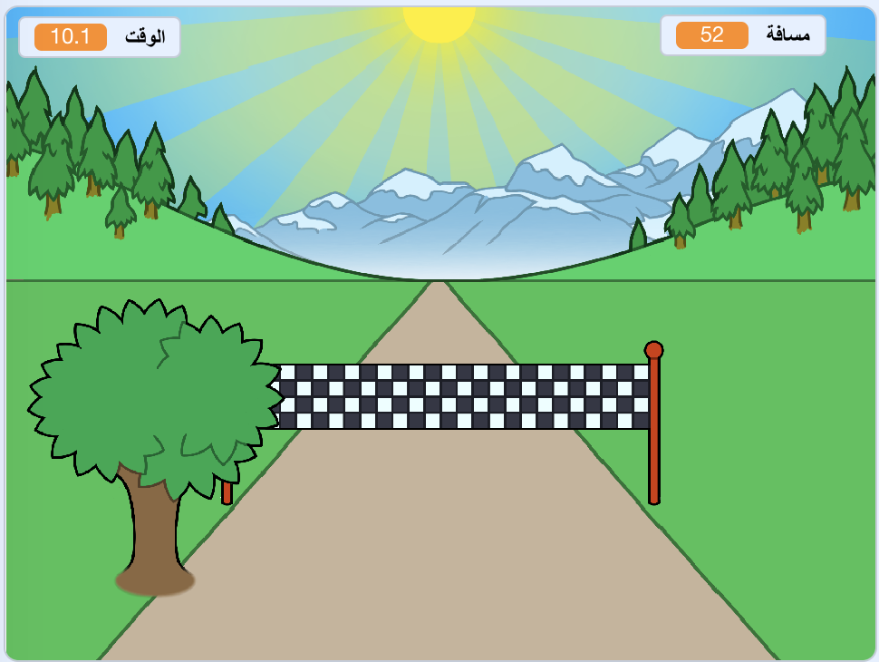

--- no-print ---

هذا هو إصدار ** Scratch 3 ** من المشروع. هناك أيضًا [ إصدار Scratch 2 للمشروع ](https://projects.raspberrypi.org/en/projects/sprint-scratch2).

--- /no-print ---

## المقدمة

سوف تتعلم كيفية إنشاء لعبة الركض الخاصة بك ، حيث يجب عليك استخدام مفتاحي السهم الايمن و الايسر للوصول إلى خط النهاية بأسرع ما يمكن.

--- no-print ---

  <iframe allowtransparency="true" width="485" height="402" src="https://scratch.mit.edu/projects/embed/298930696/?autostart=false" frameborder="0" scrolling="no"></iframe>
  

--- /no-print ---

--- print-only ---

--- /print-only ---

--- collapse ---
---
title: ما ستحتاج إليه
---

### الأجهزة

+ جهاز حاسوب يدعم تشغيل برنامج Scratch

### البرامج

+ برنامج Scratch 3 (سواء أكان [عبر الإنترنت](http://rpf.io/scratchon){:target="_blank"} أو [دون اتصال بالإنترنت](http://rpf.io/scratchoff){:target="_blank"})

### للتحميل

برنامج البداية ستجدة [هنا ](http://rpf.io/p/en/sprint-go){:target="_blank"}.

--- /collapse ---

--- collapse ---
---
title: ما الذي ستتعلمه
---

- كيفية تحريك الكائنات
- كيفية استخدام لوحة المفاتيح
- كيفية استخدام البث

--- /collapse ---

--- collapse ---
---
title: معلومات إضافية للمعلمين
---

--- no-print ---

إذا كنت بحاجة إلى طباعة هذا المشروع، فالرجاء استخدام [نسخة متوافقة مع الطابعة](https://projects.raspberrypi.org/en/projects/sprint/print){:target="_blank"}.

--- /no-print ---

يمكنك الحصول على [المشروع كاملاً من هنا](http://rpf.io/p/en/sprint-get){:target="_blank"}.

--- /collapse ---

