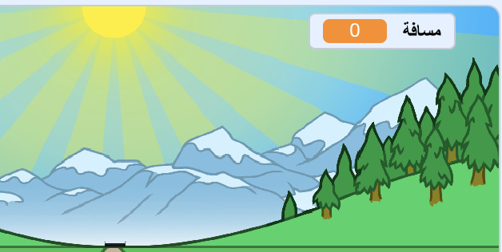

## قطع المسافة

دعنا نحرك خط النهاية عند الضغط على مفاتيح الأسهم.

--- task ---

عليك السماح للاعب بالضغط على مفاتيح الأسهم __حتى يتم عبور مسافة 100 متر__. للقيام بذلك ، قم بإنشاء متغير جديد باسم `المسافة`{:class="block3variables"}.

[[[generic-scratch3-add-variable]]]

--- /task ---

--- task ---

يمكنك الان رؤية المتغير الجديد على المنصة. اسحبه إلى الزاوية الاعلى اليمنى.



--- /task ---

--- task ---

قم بتعيين `المسافة`{:class="block3variables"} إلى 0 عند النقر على العلم.


```blocks3
when green flag clicked
+set [المسافة v] to [0]
go to x: (0) y: (30)
set size to (1) %
```

--- /task ---

--- task ---

بمجرد بدء السباق ، يجب على اللاعب الخاص بك أن يركض __حتى يتم عبور مسافة 100 متر__.


```blocks3
when I receive [إبدأ v]
repeat until <(المسافة :: variables) = [100]>
end 
```

--- /task ---

--- task ---

أضف رمز بحيث يصبح خط النهاية أكبر قليلاً بعد أن يضغط اللاعب على مفتاح السهم الأيسر. وينبغي أن تزيد المسافة أيضا.


```blocks3
when I receive [إبدأ v]
repeat until <(المسافة :: variables) = [100]>
+wait until <key (left arrow v) pressed?>
+ change size by (1)
+ change [المسافة v] by (1)
end 
```

--- /task ---

--- task ---

انقر على العلم الأخضر لأختبار لعبتك. سوف ترى أن خط النهاية يكبر عندما يتم الضغط على السهم الأيسر ، ولكنه لا يتحرك على طول المسار.


--- /task ---

--- task ---

لإصلاح ذلك ، يمكنك إضافة رمز لتحريك خط النهاية لأسفل قليلاً في كل مرة يتم فيها الضغط على مفتاح.


```blocks3
when I receive [إبدأ v]
repeat until <(المسافة :: variables) = [100]>
wait until <key (left arrow v) pressed?>
change size by (1)
+change y by (-1.5)
change [المسافة v] by (1)
end 
```

--- /task ---

--- task ---

اختبر برنامجك مرة أخرى وسترى خط النهاية يتقدم اليك.


--- /task ---

--- task ---

يجب عليك أن تفعل نفس الشيء لمفتاح السهم الأيمن.


```blocks3
when I receive [إبدأ v]
repeat until <(المسافة :: variables) = [100]>
wait until <key (left arrow v) pressed?>
change size by (1)
change y by (-1.5)
change [المسافة v] by (1)
+wait until <key (right arrow v) pressed?>
+change size by (1)
+change y by (-1.5)
+change [المسافة v] by (1)
end 
```

--- /task ---

--- task ---

إذا قمت بالنقر لرؤية اشكال خط النهاية ، يجب أن ترى أن هناك 2.


--- /task ---

--- task ---

يمكنك التبديل إلى الشكل "المقطوع" (لإنهاء اللعبة) في نهاية السباق. لا تنسى التبديل إلى الشكل "العادي" في بداية السباق!


```blocks3
when I receive [إبدأ v]
repeat until <(المسافة :: variables) = [100]>
wait until <key (left arrow v) pressed?>
change size by (1)
change y by (-1.5)
change [المسافة v] by (1)
wait until <key (right arrow v) pressed?>
change size by (1)
change y by (-1.5)
change [المسافة v] by (1)
end 
+switch costume to (مقطوع v)
+stop [all v]
```

```blocks3
when green flag clicked
+switch costume to (عادي v)
set [المسافة v] to [0]
```

--- /task ---

--- task ---

إذا كنت تريد تشغيل صوت في النهاية ، فعليك تغيير `إيقاف الكل`{:class="block3control"} الى`المقاطع الاخرى في الكائن`{:class="block3control"}.

هذا يعني أن المؤقت الذي ستنشئه سيتوقف عن العد ، لكن الصوت سيظل قيد التشغيل.


```blocks3
switch costume to (مقطوع v)
+ stop [other scripts in sprite v]
+ start sound (cheer v)
```

--- /task ---

هل لاحظت أنه يمكنك خداع لعبتك بمجرد الضغط على مفتاحي السهم الأيمن والأيسر؟

--- task ---

لإصلاح ذلك ، تحتاج إلى التأكد من الضغط على كل مفتاح __ثم تركه__ قبل تحريك خط النهاية.

إليك الرمز الذي ستحتاج إلى إضافته:


```blocks3
wait until <key (left arrow v) pressed?>
+wait until <not <key (left arrow v) pressed?>>
change size by (1)
```

ستحتاج إلى القيام بنفس الشيء لمفتاح السهم الأيمن.


```blocks3
wait until <not <key (right arrow v) pressed?>>
```

--- /task ---
