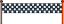

## من هو الأسرع؟

دعنا نضيف مؤقتًا إلى لعبتك ، لمعرفة من بامكانه الركض اسرع.

--- task ---

قم بإنشاء متغير جديد بالاسم `وقت`{:class="block3variables"}. سوف يظهر على الشاشة. اسحبه إلى الزاوية الاعلى اليمنى.


--- /task ---

--- task ---

اضبط الوقت على 0 في بداية اللعبة.



```blocks3
when green flag clicked
switch costume to (عادي v)
set [المسافة v] to [0]
+ set [الوقت v] to [0]
go to x: (0) y: (30)
set size to (1) %
```

--- /task ---

--- task ---

أضف هذا الكود البرمجي لجعل عداد الوقت الخاص بك يبدأ الحساب عند بدء اللعبة.


```blocks3
when I receive [إبدأ v]
forever
wait (0.1) seconds
change [الوقت v] by (0.1)
end
```

--- /task ---

--- task ---

اختبر برنامجك بالنقر على العلم الأخضر. من المفترض أن ترى أن عداد الوقت يحسب حتى مسافة 100 متر.


--- /task ---

