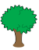
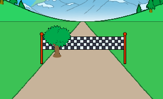

## إضافة مشهد

دعونا نبرمج شجرة تتحرك عند حركة اللاعب.

--- task ---

أولاً ، ضع الشجرة واجعلها صغيرة عند النقر على العلم.



```blocks3
when green flag clicked
show
go to x: (-50) y: (20)
set size to (1) %
```

--- /task ---


--- task ---

حالما يبدأ السباق، ينبغي أن تتحرك الشجرة إلى أن يقوم اللاعب بقطع مسافة 100 متر.


```blocks3
when I receive [start v]
repeat until <(distance :: variables) = [100]>
end

```

--- /task ---

--- task ---

بمجرد الضغط على المفتاح الأيسر (وتركه) ، ستكبر الشجرة وتتحرك - تمامًا كخط النهاية.


```blocks3
when I receive [start v]
repeat until <(distance :: variables) = [100]>
+wait until <key (left arrow v) pressed?>
+wait until <not  <key (left arrow v) pressed?>>
+change size by (1)
+change y by (-1.5)
end
```

--- /task ---

--- task ---

إذا اختبرت شجرتك ، سترى أنها تتحرك لأسفل على طول الطريق.



--- /task ---

--- task ---

لإصلاح ذلك ، أضف كود برمجي لجعل الشجرة تتحرك بعيدًا عن المسار قليلاً.


```blocks3
when I receive [start v]
repeat until <(distance :: variables) = [100]>
wait until <key (left arrow v) pressed?>
wait until <not  <key (left arrow v) pressed?>>
change size by (1)
change y by (-1.5)
+change x by (-2)
end
```

--- /task ---

--- task ---

يجب عليك أن تفعل نفس الشيء لمفتاح السهم الأيمن. هذا ما ينبغي ان تبدو عليه تعليماتك البرمجية الخاصة بالشجرة:


```blocks3
when green flag clicked
show
go to x: (-50) y: (20)
set size to (1) %

when I receive [start v]
repeat until <(distance :: variables) = [100]>
wait until <key (left arrow v) pressed?>
wait until <not  <key (left arrow v) pressed?>>
change size by (1)
change y by (-1.5)
change x by (-2)
wait until <key (right arrow v) pressed?>
wait until <not  <key (right arrow v) pressed?>>
change size by (1)
change y by (-1.5)
change x by (-2)
end
```

--- /task ---

