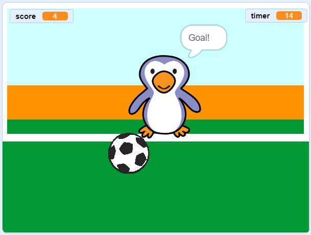

## ما التالي؟

ألق نظرة على مشروع [حارس المرمى](https://projects.raspberrypi.org/en/projects/beat-the-goalie) في برنامج Scratch.

--- no-print ---

انقر على العلم الأخضر للبدء. استخدم مفاتيح الأسهم اليمنى واليسرى للتحكم بحارس المرمى، واضغط على <kbd>مسافة</kbd> لركل الكرة.

  <iframe allowtransparency="true" width="485" height="402" src="https://scratch.mit.edu/projects/embed/285942132/?autostart=false" frameborder="0" scrolling="no"></iframe>

--- /no-print ---

--- print-only ---

--- /print-only ---
