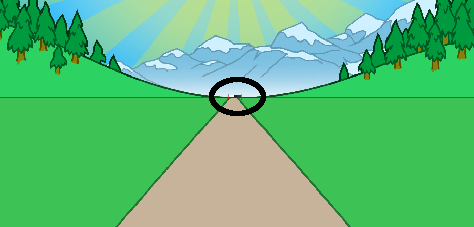

## Auf die Plätze...

Beginnen wir mit einem Countdown für das Rennen.

--- task ---

Öffne das Scratch-Basisprojekt 'Sprint'.

**Online**: Öffne das [Basisprojekt](http://rpf.io/sprint-on){:target="_blank"}.

Wenn du bereits einen Scratch-Account besitzt, kannst du dir durch Klick auf **Remix** eine Kopie anlegen.

**Offline**: Öffne das [Basisprojekt](http://rpf.io/p/en/sprint-go){:target="_blank"} im Offline-Editor.

Wenn du Scratch herunterladen und auf deinem Rechner installieren möchtest, dann findest du die Datei unter diesem Link: [rpf.io/scratchoff](http://rpf.io/scratchoff){:target="_blank"}.

Im Basisprojekt solltest du eine Straße und eine Ziellinie sehen.


--- /task ---

--- task ---

Lass uns zunächst die Ziellinie am Horizont platzieren:


```blocks3
Wenn die grüne Flagge angeklickt wird
gehe zu x: (0) y: (30)
setze Größe auf (1) %
```

--- /task ---

--- task ---

Wenn du auf die Flagge klickst, um deinen Code zu testen, siehst du deine Ziellinie in der Ferne.



--- /task ---

--- task ---

Verwende als Nächstes `sage`{: class = "block3looks"} -Blöcke, um einen Countdown zu erstellen, und sende dann eine `start`{: class = "block3events"} -Nachricht.


```blocks3
Wenn die grüne Flagge angeklickt wird 
gehe zu x: (0) y: (30)
setze Größe auf (1) %
+sage [3] für (1) Sek
+sage [2] für (1) Sek
+sage [1] für (1) Sek
+Nachricht an alle (Start v)
```

--- /task ---

--- task ---

Du kannst deinem Countdown auch einen Sound hinzufügen.


```blocks3
Wenn die grüne Flagge angeklickt wird 
gehe zu x: (0) y: (30)
setze Größe auf (1) %
sage [3] für (1) Sek
sage [2] für (1) Sek
sage [1] für (1) Sek
+ spiele Klang (Siren Whistle v) 
sende Nachricht an alle (Start v)
```

--- /task ---
