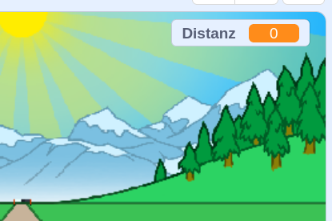
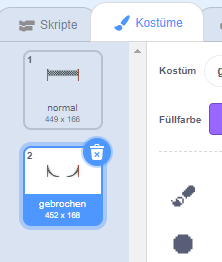

## Die Entfernung überbrücken

Verschieben wir die Ziellinie, wenn die Pfeiltasten gedrückt werden.

--- task ---

Wir möchten dem Spieler erlauben, die Pfeiltasten zu drücken __bis er 100 Meter__ gelaufen ist. Erstelle dazu eine neue Variable mit dem Namen `Distanz`{:class="block3variables"}.

[[[generic-scratch3-add-variable]]]

--- /task ---

--- task ---

Du solltest die neue Variable auf der Bühne sehen. Ziehe sie in die obere rechte Ecke.



--- /task ---

--- task ---

Setze den `Abstand`{:class="block3variables"} auf 0, wenn auf die Flagge geklickt wird.


```blocks3
when green flag clicked
+set [distance v] to [0]
go to x: (0) y: (30)
set size to (1) %
```

--- /task ---

--- task ---

Sobald das Rennen beginnt, soll der Spieler __sprinten bis er 100 Meter gelaufen__.


```blocks3
when I receive [start v]
repeat until <(distance :: variables) = [100]>
end 
```

--- /task ---

--- task ---

Füge einen weiteren Code hinzu, damit deine Ziellinie etwas größer wird, nachdem der Spieler die linke Pfeiltaste gedrückt hat. Der Abstand sollte ebenfalls zunehmen.


```blocks3
when I receive [start v]
repeat until <(distance :: variables) = [100]>
+wait until <key (left arrow v) pressed?>
+ change size by (1)
+ change [distance v] by (1)
end 
```

--- /task ---

--- task ---

Klick auf die grüne Flagge, um dein Projekt zu testen. Du solltest sehen, dass die Ziellinie größer wird wenn der linke Pfeil gedrückt wird, sich aber nicht entlang der Strecke bewegt.


--- /task ---

--- task ---

Um dies zu beheben, kannst du Code hinzufügen, um die Ziellinie bei jedem Tastendruck leicht nach unten zu verschieben.


```blocks3
when I receive [start v]
repeat until <(distance :: variables) = [100]>
wait until <key (left arrow v) pressed?>
change size by (1)
+change y by (-1.5)
change [distance v] by (1)
end 
```

--- /task ---

--- task ---

Teste dein Projekt erneut und du solltest sehen, wie sich die Ziellinie die Bühne hinunter auf dich zu bewegt.


--- /task ---

--- task ---

Du solltest das auch für die rechte Pfeiltaste tun.


```blocks3
when I receive [start v]
repeat until <(distance :: variables) = [100]>
wait until <key (left arrow v) pressed?>
change size by (1)
change y by (-1.5)
change [distance v] by (1)
+wait until <key (right arrow v) pressed?>
+change size by (1)
+change y by (-1.5)
+change [distance v] by (1)
end 
```

--- /task ---

--- task ---

Wenn Du auf den Reiter Kostüme klickst, siehst Du, dass es dort zwei Ziellinien gibt.



--- /task ---

--- task ---

Du kannst am Ende des Rennens zum Kostüm 'broken' (kaputt) wechseln (und das Spiel beenden). Remember to switch to the 'normal' costume at the start of the race!


```blocks3
when I receive [start v]
repeat until <(distance :: variables) = [100]>
wait until <key (left arrow v) pressed?>
change size by (1)
change y by (-1.5)
change [distance v] by (1)
wait until <key (right arrow v) pressed?>
change size by (1)
change y by (-1.5)
change [distance v] by (1)
end 
+switch costume to (broken v)
+stop [all v]
```

```blocks3
when green flag clicked
+switch costume to (normal v)
set [distance v] to [0]
```

--- /task ---

--- task ---

Wenn du am Ende einen Klang abspielen möchtest, musst du den Block `stoppe alle`{: class = "block3control"} in `stoppe andere Skripte der Figur`{: class = "block3control"} ändern.

Dies bedeutet, dass der Timer aufhört zu zählen, der Sound jedoch weiterhin abgespielt wird.


```blocks3
switch costume to (broken v)
+ stop [other scripts in sprite v]
+ start sound (cheer v)
```

--- /task ---

Hast Du bemerkt, dass man beim Spiel betrügen kann, indem man einfach die linke und rechte Pfeiltaste gedrückt hält?

--- task ---

Um das zu beheben, musst du sicherstellen, dass jede Taste gedrückt __und dann losgelassen__ wird, bevor die Ziellinie verschoben wird.

Hier ist der Code, den du hinzufügen musst:


```blocks3
wait until <key (left arrow v) pressed?>
+wait until <not <key (left arrow v) pressed?>>
change size by (1)
```

Dasselbe musst du für die rechte Pfeiltaste tun.


```blocks3
wait until <not <key (right arrow v) pressed?>>
```

--- /task ---
