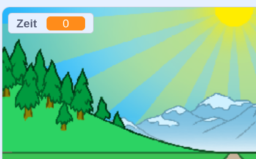

## Wer ist der Schnellste?

Lass uns deinem Spiel einen Timer hinzufügen, um zu sehen, wer am schnellsten Sprinten kann.

--- task ---

Erstelle eine neue `Zeit`{:class="block3variables"} Variable. Die Variable wird auf der Bühne erscheinen. Ziehe sie in die obere linke Ecke.



--- /task ---

--- task ---

Setze die Zeit zu Beginn deines Spiels auf 0.


```blocks3
when green flag clicked
switch costume to (normal v)
set [distance v] to [0]
+ set [time v] to [0]
go to x: (0) y: (30)
set size to (1) %
```

--- /task ---

--- task ---

Füge diesen Code hinzu, damit der Timer zu Beginn des Spiels hochzählt.


```blocks3
when I receive [start v]
forever
wait (0.1) seconds
change [time v] by (0.1)
end
```

--- /task ---

--- task ---

Test your project by clicking the green flag. You should see your timer counts up until you've sprinted 100 meters.


--- /task ---

