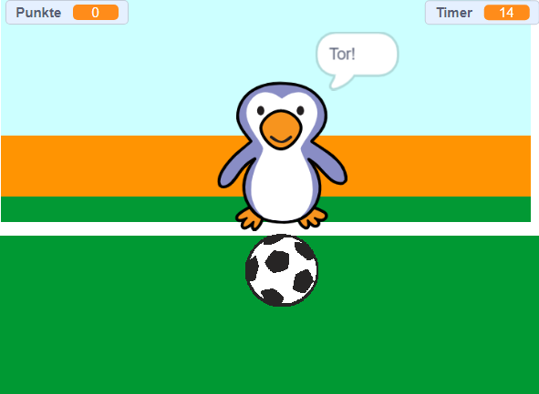

## Wie geht's weiter?

Schau dir das [Schlage den Torwart](https://projects.raspberrypi.org/en/projects/beat-the-goalie) Scratch-Projekt an.

--- no-print ---

Klicke auf die grüne Flagge, um zu beginnen. Verwende die linke und rechte Pfeiltaste, um den Torwart zu steuern, und drücke die <kbd>Leerzeichen-Taste</kbd>, um den Ball zu treten.

  <iframe allowtransparency="true" width="485" height="402" src="https://scratch.mit.edu/projects/embed/285942132/?autostart=false" frameborder="0" scrolling="no"></iframe>

--- /no-print ---

--- print-only ---

--- /print-only ---
