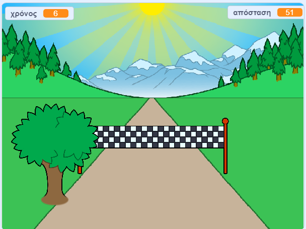

--- no-print ---

Αυτή είναι η **Scratch 3** έκδοση του έργου. Υπάρχει επίσης η [έκδοση Scratch 2 του έργου](https://projects.raspberrypi.org/el-GR/projects/sprint-scratch2).

--- /no-print ---

## Εισαγωγή

Θα μάθεις πώς να δημιουργείς το δικό σου παιχνίδι σπριντ, στο οποίο θα πρέπει να χρησιμοποιήσεις το αριστερό και δεξί βέλος για να φτάσεις στη γραμμή τερματισμού όσο πιο γρήγορα μπορείς.

--- no-print ---

  <iframe allowtransparency="true" width="485" height="402" src="https://scratch.mit.edu/projects/embed/406228817/?autostart=false" frameborder="0" scrolling="no"></iframe>
  

--- /no-print ---

--- print-only ---

--- /print-only ---

--- collapse ---
---
title: Τι θα χρειαστείς
---

### Υλικό

+ Ένας υπολογιστής ικανός να τρέχει το Scratch

### Λογισμικό

+ Scratch 3 (είτε [online](http://rpf.io/scratchon){:target="_blank"} είτε [offline](http://rpf.io/scratchoff){:target="_blank"})

### Λήψεις

Το αρχικό project μπορεί να βρεθεί [εδώ](http://rpf.io/p/el-GR/sprint-go){:target="_blank"}.

--- /collapse ---

--- collapse ---
---
title: Τι θα μάθεις
---

- Πώς να κάνεις τα αντικείμενα να κινούνται
- Πώς να προκαλείς ενέργειες ανάλογα με την είσοδο του πληκτρολογίου
- Πώς να χρησιμοποιείς τη μετάδοση μηνυμάτων

--- /collapse ---

--- collapse ---
---
title: Πρόσθετες πληροφορίες για εκπαιδευτικούς
---

--- no-print ---

Αν χρειαστεί να εκτυπώσεις αυτό το έργο, χρησιμοποίησε την [εκτυπώσιμη έκδοση](https://projects.raspberrypi.org/el-GR/projects/sprint/print){:target="_blank"}.

--- /no-print ---

Μπορείς να βρεις [το ολοκληρωμένο έργο εδώ](http://rpf.io/p/el-GR/sprint-get){:target="_blank"}.

--- /collapse ---

