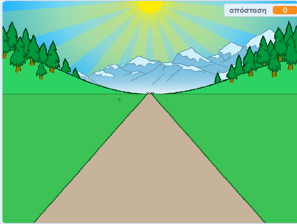

## Διανύοντας την απόσταση

Ας μετακινήσουμε την κορδέλα τερματισμού όταν πατηθούν τα βελάκια του πληκτρολογίου.

--- task ---

Θέλεις να επιτρέψεις στον παίκτη να πατήσει τα βελάκια __ώσπου να τρέξει 100 μέτρα__. Για να γίνει αυτό, δημιούργησε μια νέα μεταβλητή με το όνομα `απόσταση`{:class="block3variables"}.

[[[generic-scratch3-add-variable]]]

--- /task ---

--- task ---

Θα πρέπει να δεις τη νέα μεταβλητή στη σκηνή. Σύρε τη στην επάνω δεξιά γωνία.



--- /task ---

--- task ---

Όρισε την `απόσταση`{:class="block3variables"} σε 0 όταν γίνει κλικ στη σημαία.


```blocks3
when green flag clicked
+set [απόσταση v] to [0]
go to x: (0) y: (30)
set size to (1) %
```

--- /task ---

--- task ---

Μόλις ξεκινήσει ο αγώνας, ο παίκτης πρέπει να τρέξει __μέχρι να διανύσει 100 μέτρα__.


```blocks3
when I receive [έναρξη v]
repeat until <(απόσταση :: variables) = [100]>
end 
```

--- /task ---

--- task ---

Πρόσθεσε κώδικα έτσι ώστε η γραμμή τερματισμού να γίνει λίγο μεγαλύτερη όταν ο παίκτης πατήσει το αριστερό βελάκι. Η απόσταση πρέπει επίσης να αυξηθεί.


```blocks3
when I receive [έναρξη v]
repeat until <(απόσταση :: variables) = [100]>
+wait until <key (left arrow v) pressed?>
+ change size by (1)
+ change [απόσταση v] by (1)
end 
```

--- /task ---

--- task ---

Κάνε κλικ στην πράσινη σημαία για να δοκιμάσεις το παιχνίδι σου. Θα πρέπει να δεις ότι η γραμμή τερματισμού μεγαλώνει όταν πατηθεί το αριστερό βέλος, αλλά δεν κινείται κατά μήκος του δρόμου.


--- /task ---

--- task ---

Για να το διορθώσεις αυτό, μπορείς να προσθέσεις κώδικα για να μετακινείς τη γραμμή τερματισμού ελαφρώς κάτω κάθε φορά που πατάς ένα βελάκι.


```blocks3
when I receive [έναρξη v]
repeat until <(απόσταση :: variables) = [100]>
wait until <key (left arrow v) pressed?>
change size by (1)
+change y by (-1.5)
change [απόσταση v] by (1)
end 
```

--- /task ---

--- task ---

Δοκίμασε ξανά το έργο σου και θα πρέπει να βλέπεις την κορδέλα τερματισμού να κινείται προς τα κάτω.


--- /task ---

--- task ---

Στη συνέχεια, πρέπει να κάνεις το ίδιο για το δεξί βελάκι.


```blocks3
when I receive [έναρξη v]
repeat until <(απόσταση :: variables) = [100]>
wait until <key (left arrow v) pressed?>
change size by (1)
change y by (-1.5)
change [απόσταση v] by (1)
+wait until <key (right arrow v) pressed?>
+change size by (1)
+change y by (-1.5)
+change [απόσταση v] by (1)
end 
```

--- /task ---

--- task ---

Εάν κάνεις κλικ για να δεις τις ενδυμασίες της κορδέλας τερματισμού, θα πρέπει να βλέπεις δύο ενδυμασίες.


--- /task ---

--- task ---

Μπορείς να μεταβείς στην ενδυμασία «κομμένη» (και να τερματίσεις το παιχνίδι) στο τέλος του αγώνα. Θυμήσου να μεταβείς στην «κανονική» ενδυμασία στην αρχή του αγώνα!


```blocks3
when I receive [έναρξη v]
repeat until <(απόσταση :: variables) = [100]>
wait until <key (left arrow v) pressed?>
change size by (1)
change y by (-1.5)
change [απόσταση v] by (1)
wait until <key (right arrow v) pressed?>
change size by (1)
change y by (-1.5)
change [απόσταση v] by (1)
end 
+switch costume to (κομμένη v)
+stop [all v]
```

```blocks3
when green flag clicked
+switch costume to (κανονική v)
set [απόσταση v] to [0]
```

--- /task ---

--- task ---

Αν θέλεις να ακούσεις έναν ήχο στο τέλος, θα πρέπει να αλλάξεις το μπλοκ `σταμάτησε όλα`{:class="block3control"} σε `σταμάτησε άλλα σενάρια σε αυτό το αντικείμενο`{:class="block3control"}.

Αυτό σημαίνει ότι το χρονόμετρο που θα δημιουργήσεις θα σταματήσει να μετράει, αλλά ο ήχος θα συνεχίσει να παίζει.


```blocks3
switch costume to (κομμένη v)
+ stop [other scripts in sprite v]
+ start sound (cheer v)
```

--- /task ---

Έχεις παρατηρήσει ότι μπορείς να εξαπατήσεις το παιχνίδι σου κρατώντας πατημένο το αριστερό και το δεξί βέλος;

--- task ---

Για να το διορθώσεις, πρέπει να βεβαιωθείς ότι πατιέται κάθε πλήκτρο __και στη συνέχεια απελευθερώνεται__ πριν μετακινήσεις την κορδέλα τερματισμού.

Εδώ είναι ο κώδικας που θα χρειαστεί να προσθέσεις:


```blocks3
wait until <key (left arrow v) pressed?>
+wait until <not <key (left arrow v) pressed?>>
change size by (1)
```

Στη συνέχεια, πρέπει να κάνεις το ίδιο για το δεξί βελάκι.


```blocks3
wait until <not <key (right arrow v) pressed?>>
```

--- /task ---
