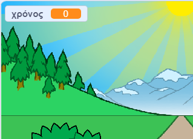

## Ποιος είναι πιο γρήγορος;

Ας προσθέσουμε ένα χρονόμετρο στο παιχνίδι σου, για να δούμε ποιος μπορεί να τρέξει πιο γρήγορα.

--- task ---

Δημιούργησε μία νέα μεταβλητή `χρόνος`{:class="block3variables"}. Θα εμφανιστεί στη σκηνή. Σύρε τη στην επάνω αριστερή γωνία.



--- /task ---

--- task ---

Όρισε το χρόνο σε 0 στην αρχή του παιχνιδιού σου.


```blocks3
when green flag clicked
switch costume to (κανονική v)
set [απόσταση v] to [0]
+ set [χρόνος v] to [0]
go to x: (0) y: (30)
set size to (1) %
```

--- /task ---

--- task ---

Βάλε αυτόν τον κώδικα για να μετράει το χρονόμετρο όταν ξεκινά το παιχνίδι.


```blocks3
when I receive [έναρξη v]
forever
wait (0.1) seconds
change [χρόνος v] by (0.1)
end
```

--- /task ---

--- task ---

Δοκίμασε το έργο σου κάνοντας κλικ στην πράσινη σημαία. Θα πρέπει να δεις ότι το χρονόμετρο μετράει μέχρι να τρέξεις 100 μέτρα.


--- /task ---

