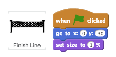
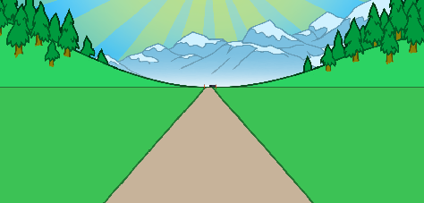
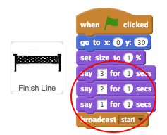
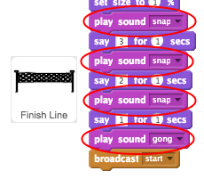

## On your marks...

Let's start by creating a race countdown.

+ Open the 'Sprint' Scratch project. Your club leader will give you a copy of this project, or you can open it online at <a href="http://jumpto.cc/sprint-resources" target="_blank">jumpto.cc/sprint-resources</a>.

+ To start with, let's put the finish line on the horizon:

	

+ If you click the flag to test your code, you'll see your finish line in the distance.

	

+ Next, use `say`{:class="blocklooks"} blocks to create a countdown, and then broadcast a `start`{:class="blockevents"} message.

		

+ You can also add sounds to your countdown.

		

