## Going the distance

Let's move the finish line when the arrow keys are pressed.

+ You want to allow the player to press the arrow keys __until they have run 100 meters__. To do this, create a new variable called `distance`{:class="blockdata"}.

	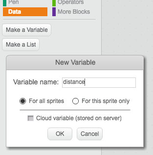

+ You should see your new variable on the stage. Right-click the variable and select 'large readout'.

	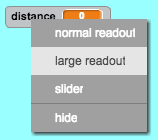

+ Drag your variable to the bottom of the stage.

	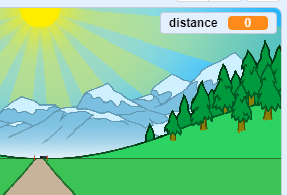

+ Set the `distance`{:class="blockdata"} to 0 when the flag is clicked.

	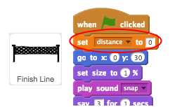

+ Once your race starts, your player should sprint __until they have run 100 meters__.

	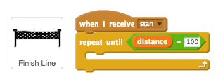

+ Add code so that your finish line gets a little bigger after the player presses the left arrow key. The distance should also increase.

	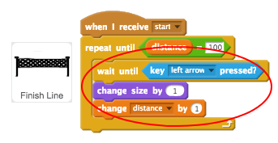

+ Click the green flag to test your project. You should see that the finish line gets bigger when the left arrow is pressed, but doesn't move along the track.

	

+ To fix this, you can add code to move the finish line down slightly each time a key is pressed.

	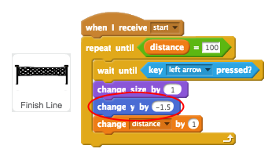

+ Test your project again and you shoud see the finish line move down the stage towards you.

	

+ You should then do the same for the right arrow key.

	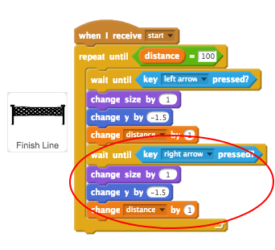

+ If you click to see the finish line's costumes, you should see that there are 2.

	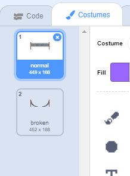

+ You can switch to the 'broken' costume (and end the game) at the end of the race. Remember to switch to the 'normal' costume at the start of the race!

	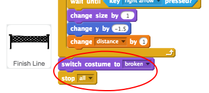

+ If you want to play a sound at the end, you'll have change your `stop all`{:class="blockcontrol"} block to `stop other scripts in sprite`{:class="blockcontrol"}.

	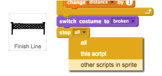

	This means that the timer you'll create will stop counting, but the sound will still play.

	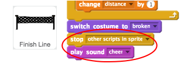

+ Have you noticed that you can cheat your game by just holding down the left and right arrow keys?

	To fix this, you need to make sure that each key is pressed __and then released__ before moving the finish line.

	Here's the code you'll need to add:

	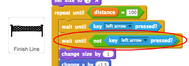

	You'll need to do the same for the right arrow key.

