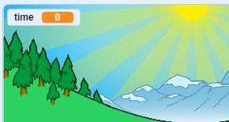

## Who is the fastest?

Let's add a timer to your game, to see who can sprint the fastest.

+ Create a new `time`{:class="blockdata"} variable, and move it to the center of your stage.

	

+ Set the time to 0 at the start of your game.

	

+ Add this code to make your timer count up when the game starts.

	

+ Test your project by clicking the green flag. You should see your timer counts up until you've sprinted 100 meters.

	

