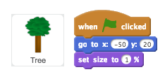
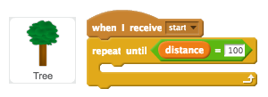
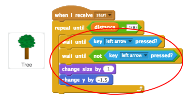
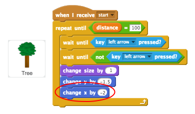
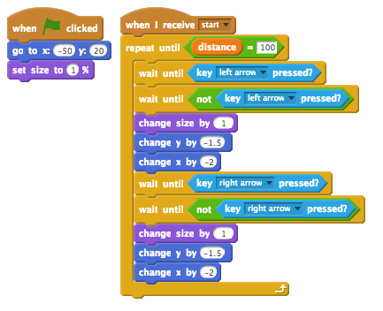

## Adding scenery

Let's code a tree to move as the player sprints.

+ First, position the tree and make it small when the flag is clicked.

	

+ Once the race starts, the tree should move until the player has sprinted 100 meters.

	

+ Once the left key has been pressed (and released), the tree should get bigger and move - just like the finish line.

	

+ If you test your tree, you'll see that it moves downwards, onto the track.

	

+ To fix this, add code to make your tree move away from the track slightly.

	

+ You should also do the same for the right arrow key. Here's how your Tree's code should look:

	

