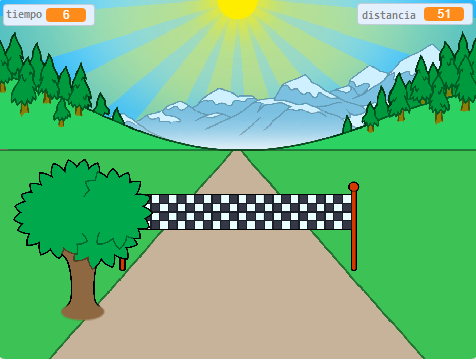

--- no-print ---

Esta es una versión de **Scratch 3** del proyecto. También hay una [versión del proyecto en Scratch 2](https://projects.raspberrypi.org/es-ES/projects/sprint-scratch2).

--- /no-print ---

## Introducción

Vas a aprender a crear tu propio juego de carreras, en el que tienes que usar las teclas de flecha izquierda y derecha para alcanzar la línea de meta tan rápido como puedas.

--- no-print ---

  <iframe allowtransparency="true" width="485" height="402" src="https://scratch.mit.edu/projects/embed/406794034/?autostart=false" frameborder="0" scrolling="no"></iframe>
  

--- /no-print ---

--- print-only ---

--- /print-only ---

--- collapse ---
---
title: Lo que necesitarás
---

### Hardware

+ Ordenador capaz de ejecutar Scratch

### Software

+ Scratch 3 (ya sea [en línea](https://rpf.io/scratchon){:target="_blank"} o [sin conexión](https://rpf.io/scratchoff){:target="_blank"})

### Descargas

El proyecto de iniciación puede encontrarse [aquí](https://rpf.io/p/es-ES/sprint-go){:target="_blank"}.

--- /collapse ---

--- collapse ---
---
title: Lo que vas a aprender
---

- Cómo animar objetos
- Cómo usar entradas del teclado
- Cómo utilizar las emisiones

--- /collapse ---

--- collapse ---
---
title: Información adicional para educadores
---

--- no-print ---

Si necesitas imprimir este proyecto, usa la [versión para imprimir](https://projects.raspberrypi.org/es-ES/projects/sprint/print){:target="_blank"}.

--- /no-print ---

Puedes [encontrar el proyecto completo aquí](https://rpf.io/p/es-ES/sprint-get){:targets="_blank"}.

--- /collapse ---

