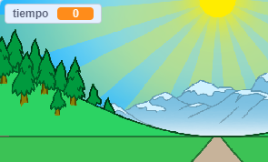

## ¿Quién es el más veloz?

Vamos a añadir un cronómetro a tu juego, para ver quién puede correr más rápido.

--- task ---

Crea una nueva variable `tiempo`{:class="block3variables"}. Aparecerá en el escenario. Arrástrala a la esquina superior derecha.



--- /task ---

--- task ---

Dale el valor 0 al comienzo de tu juego.


```blocks3
when green flag clicked
switch costume to (normal v)
set [distance v] to [0]
+ set [time v] to [0]
go to x: (0) y: (30)
set size to (1) %
```

--- /task ---

--- task ---

Añade este código para hacer que tu cronómetro empiece a contar cuando el juego comience.


```blocks3
when I receive [start v]
forever
wait (0.1) seconds
change [time v] by (0.1)
end
```

--- /task ---

--- task ---

Prueba tu proyecto haciendo clic en la bandera verde. Deberías ver que tu cronómetro cuenta hasta que hayas recorrido 100 metros.


--- /task ---

