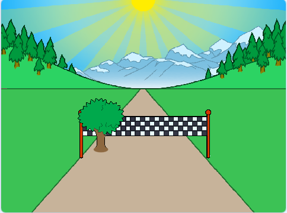

## Añadiendo el paisaje

Vamos a programar un árbol para que se mueva a medida que el jugador corre.

--- task ---

Primero, coloca el árbol y hazlo pequeño cuando se haga clic en la bandera.


```blocks3
when green flag clicked
show
go to x: (-50) y: (20)
set size to (1) %
```

--- /task ---


--- task ---

Una vez que la carrera comience, el árbol deberá moverse hasta que el jugador haya recorrido 100 metros.


```blocks3
when I receive [salida v]
repeat until <(distancia :: variables) = [100]>
end

```

--- /task ---

--- task ---

Una vez presionada la tecla izquierda (y liberada), el árbol debería hacerse más grande y moverse - al igual que la línea de llegada.


```blocks3
when I receive [salida v]
repeat until <(distancia :: variables) = [100]>
+wait until <key (left arrow v) pressed?>
+wait until <not  <key (left arrow v) pressed?>>
+change size by (1)
+change y by (-1.5)
end
```

--- /task ---

--- task ---

Si pruebas tu árbol, verás que se mueve hacia abajo, hacia la pista.



--- /task ---

--- task ---

Para solucionar esto, añade código para hacer que tu árbol se aleje un poco de la pista.


```blocks3
when I receive [salida v]
repeat until <(distancia :: variables) = [100]>
wait until <key (left arrow v) pressed?>
wait until <not  <key (left arrow v) pressed?>>
change size by (1)
change y by (-1.5)
+change x by (-2)
end
```

--- /task ---

--- task ---

Tendrás que hacer lo mismo con la tecla de la flecha derecha. Así es como debería verse tu código:


```blocks3
when green flag clicked
show
go to x: (-50) y: (20)
set size to (1) %

when I receive [salida v]
repeat until <(distancia :: variables) = [100]>
wait until <key (left arrow v) pressed?>
wait until <not  <key (left arrow v) pressed?>>
change size by (1)
change y by (-1.5)
change x by (-2)
wait until <key (right arrow v) pressed?>
wait until <not  <key (right arrow v) pressed?>>
change size by (1)
change y by (-1.5)
change x by (-2)
end
```

--- /task ---

