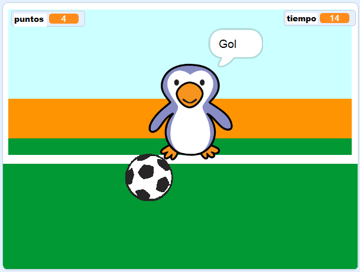

## ¿Qué hacer a continuación?

Echa un vistazo al proyecto [Beat the goalie (Bate al portero)](https://projects.raspberrypi.org/en/projects/beat-the-goalie) Scratch.

--- no-print ---

Haz clic en la bandera verde para empezar. Usa las teclas de flecha izquierda y derecha para controlar al portero y presiona <kbd>espacio</kbd> para lanzar la pelota.

  <iframe allowtransparency="true" width="485" height="402" src="https://scratch.mit.edu/projects/embed/285942132/?autostart=false" frameborder="0" scrolling="no"></iframe>

--- /no-print ---

--- print-only ---

--- /print-only ---
