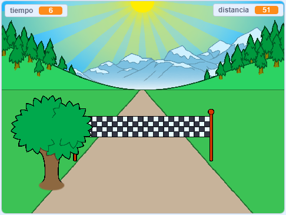

--- no-print ---

Esta es la versión **Scratch 3** del proyecto. También hay una [versión del proyecto en Scratch 2](https://projects.raspberrypi.org/en/projects/sprint-scratch2).

--- /no-print ---

## Introducción

Aprenderás a crear tu propio juego de carreras, en el que debes usar las teclas de flecha izquierda y derecha para llegar a la línea de meta lo más rápido posible.

--- no-print ---

  <iframe allowtransparency="true" width="485" height="402" src="https://scratch.mit.edu/projects/embed/298930696/?autostart=false" frameborder="0" scrolling="no"></iframe>
  

--- no-print ---

--- print-only ---

--- /print-only ---

--- collapse ---
---
title: Lo que necesitarás
---

### Hardware

+ Una computadora capaz de ejecutar Scratch

### Software

+ Scratch 3 (either [online](https://rpf.io/scratchon){:target="_blank"} or [offline](https://rpf.io/scratchoff){:target="_blank"})

### Descargas

The starter project can be found [here](https://rpf.io/p/en/sprint-go){:target="_blank"}.

--- /collapse ---

--- collapse ---
---
title: Lo que aprenderás
---

- Cómo animar objetos
- Cómo usar la entrada del teclado
- Cómo enviar mensajes

--- /collapse ---

--- collapse ---
---
title: Información adicional para educadores
---

--- no-print ---

Si necesitas imprimir este proyecto, usa la [versión para imprimir](https://projects.raspberrypi.org/en/projects/sprint/print){:target="_blank"}.

--- /no-print ---

You can find the [completed project here](https://rpf.io/p/en/sprint-get){:target="_blank"}.

--- /collapse ---

