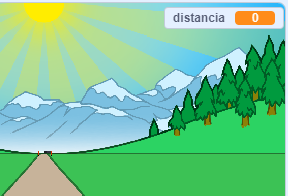
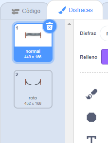

## Atravesando la distancia

Vas a mover la línea de meta cuando se presionen las teclas de flecha.

--- task ---

Permitirás que el jugador presione las teclas de flecha __hasta que haya corrido 100 metros__. Para hacerlo, crea una nueva variable llamada `distancia`{:class="block3variables"}.

[[[generic-scratch3-add-variable]]]

--- /task ---

--- task ---

Deberías ver tu nueva variable en el escenario. Arrástrala hasta la esquina superior derecha.



--- /task ---

--- task ---

Establece la `distancia`{:class="block3variables"} en 0 cuando se haga clic en la bandera.


```blocks3
when green flag clicked
+set [distancia v] to [0]
go to x: (0) y: (30)
set size to (1) %
```

--- /task ---

--- task ---

Una vez que comience tu carrera, tu jugador debería correr __hasta que haya corrido 100 metros__.


```blocks3
when I receive [iniciar v]
repeat until <(distancia :: variables) = [100]>
end 
```

--- /task ---

--- task ---

Añade código para que tu línea de meta se haga un poco más grande después de que el jugador presiona la tecla de flecha izquierda. La distancia también debería aumentar.


```blocks3
when I receive [iniciar v]
repeat until <(distancia :: variables) = [100]>
+wait until <key (left arrow v) pressed?>
+ change size by (1)
+ change [distancia v] by (1)
end 
```

--- /task ---

--- task ---

Haz clic en la bandera verde para probar tu juego. Deberías ver que la línea de meta se hace más grande cuando se presiona la flecha izquierda, pero no se mueve a lo largo de la pista.


--- /task ---

--- task ---

Para arreglar esto, puedes añadir código para mover la línea de meta ligeramente hacia abajo cada vez que se presiona una tecla.


```blocks3
when I receive [iniciar v]
repeat until <(distancia :: variables) = [100]>
wait until <key (left arrow v) pressed?>
change size by (1)
+change y by (-1.5)
change [distancia v] by (1)
end 
```

--- /task ---

--- task ---

Vuelve a probar tu proyecto y verás que la línea de meta baja por el escenario hacia ti.


--- /task ---

--- task ---

Luego debes hacer lo mismo para la tecla de flecha derecha.


```blocks3
when I receive [iniciar v]
repeat until <(distancia :: variables) = [100]>
wait until <key (left arrow v) pressed?>
change size by (1)
change y by (-1.5)
change [distancia v] by (1)
+wait until <key (right arrow v) pressed?>
+change size by (1)
+change y by (-1.5)
+change [distancia v] by (1)
end 
```

--- /task ---

--- task ---

Si haces clic para ver los disfraces de la línea de meta, verás que hay 2.



--- /task ---

--- task ---

Puedes cambiar al disfraz 'roto' (y terminar el juego) al final de la carrera. ¡Recuerda cambiar al disfraz 'normal' al comienzo de la carrera!


```blocks3
when I receive [iniciar v]
repeat until <(distancia :: variables) = [100]>
wait until <key (left arrow v) pressed?>
change size by (1)
change y by (-1.5)
change [distancia v] by (1)
wait until <key (right arrow v) pressed?>
change size by (1)
change y by (-1.5)
change [distancia v] by (1)
end 
+switch costume to (roto v)
+stop [all v]
```

```blocks3
when green flag clicked
+switch costume to (normal v)
set [distancia v] to [0]
```

--- /task ---

--- task ---

Si quieres reproducir un sonido al final, tendrás que cambiar tu bloque `detener todos`{:class="block3control"} a `detener otros programas en el objeto`{:class="block3control"}.

Esto significa que el temporizador que crearás dejará de contar, pero el sonido seguirá reproduciéndose.


```blocks3
switch costume to (roto v)
+ stop [other scripts in sprite v]
+ start sound (cheer v)
```

--- /task ---

¿Te has dado cuenta de que puedes hacer trampa en tu juego simplemente manteniendo presionadas las teclas de flecha izquierda y derecha?

--- task ---

Para arreglar esto, debes asegurarte de que cada tecla sea presionada __y luego soltada__ antes de mover la línea de meta.

Aquí está el código que necesitarás añadir:


```blocks3
wait until <key (left arrow v) pressed?>
+wait until <not <key (left arrow v) pressed?>>
change size by (1)
```

Necesitarás hacer lo mismo para la tecla de flecha derecha.


```blocks3
wait until <not <key (right arrow v) pressed?>>
```

--- /task ---
