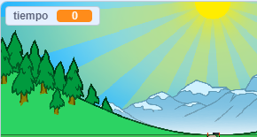
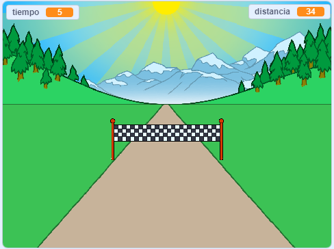

## ¿Quién es el más rápido?

Vas a añadir un cronómetro a tu juego, para ver quién puede correr más rápido.

--- task ---

Crea una nueva variable `tiempo`{:class="block3variables"}. Aparecerá en el escenario. Arrástrala hasta la esquina superior izquierda.



--- /task ---

--- task ---

Establece el tiempo en 0 al inicio de tu juego.


```blocks3
when green flag clicked
switch costume to (normal v)
set [distance v] to [0]
+ set [time v] to [0]
go to x: (0) y: (30)
set size to (1) %
```

--- /task ---

--- task ---

Añade este código para hacer que tu cronómetro cuente cuando inicie el juego.


```blocks3
when I receive [start v]
forever
wait (0.1) seconds
change [time v] by (0.1)
end
```

--- /task ---

--- task ---

Prueba tu proyecto haciendo clic en la bandera verde. Deberías ver que tu temporizador cuenta hasta que hayas corrido 100 metros.



--- /task ---

