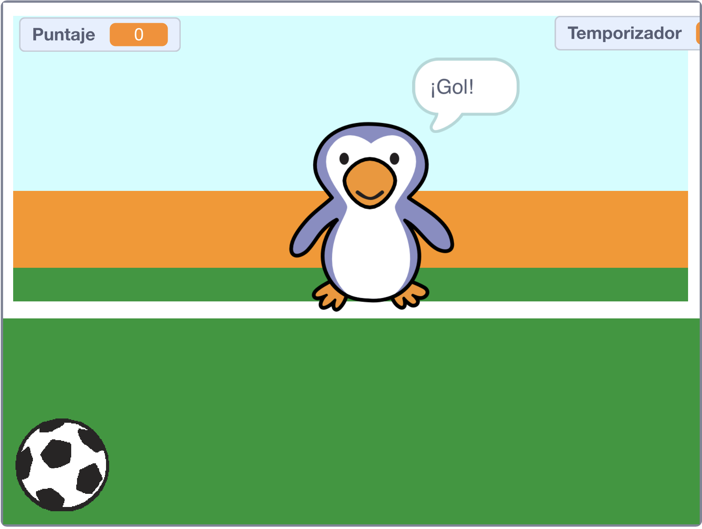

## ¿Qué sigue?

Echa un vistazo al proyecto [Gánale al portero](https://projects.raspberrypi.org/es-LA/projects/beat-the-goalie) de Scratch.

--- no-print ---

Haz clic en la bandera verde para empezar. Usa las teclas de flecha izquierda y derecha para controlar la portería y pulsa <kbd>espacio</kbd> para patear la pelota.

  <iframe allowtransparency="true" width="485" height="402" src="https://scratch.mit.edu/projects/embed/406204960/?autostart=false" frameborder="0" scrolling="no"></iframe>

--- /no-print ---

--- print-only ---

--- /print-only ---

***
Este proyecto fue traducido por voluntarios:

Ana Luisa Cubas Córdova

Carlos Yalta Vargas

Gracias a los voluntarios, podemos dar a las personas de todo el mundo la oportunidad de aprender en su propio idioma. Puedes ayudarnos a llegar a más personas ofreciéndote como voluntario para traducir. Más información en [rpf.io/translate](https://rpf.io/translate).
