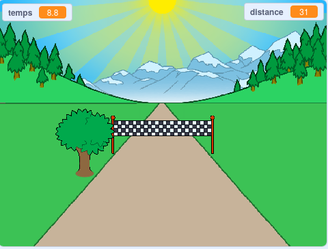

--- no-print ---

Ceci est la version **Scratch 3** du projet. Il existe également une version [Scratch 2 du projet](https://projects.raspberrypi.org/fr-FR/projects/sprint-scratch2).

--- /no-print ---

## Introduction

Tu vas apprendre à créer ton propre jeu de sprint, dans lequel tu devras utiliser les touches fléchées gauche et droite pour arriver à la ligne d'arrivée le plus rapidement possible.

--- no-print ---

  <iframe allowtransparency="true" width="485" height="402" src="https://scratch.mit.edu/projects/embed/406227474/?autostart=false" frameborder="0" scrolling="no"></iframe>
  

--- /no-print ---

--- print-only ---

--- /print-only ---

--- collapse ---
---
title: Ce qu'il te faut
---

### Matériel informatique

+ Un ordinateur capable d'exécuter Scratch

### Logiciel

+ Scratch 3 ([en ligne](https://rpf.io/scratchon){:target="_blank"} ou [hors ligne](https://rpf.io/scratchoff){:target="_blank"})

### Téléchargements

Le projet de démarrage peut être trouvé [ici](https://rpf.io/p/fr-FR/sprint-go){:target="_blank"}.

--- /collapse ---

--- collapse ---
---
title: Ce que tu vas apprendre
---

- Comment animer des sprites
- Comment utiliser la saisie au clavier
- Comment utiliser les diffusions

--- /collapse ---

--- collapse ---
---
title: Informations supplémentaires pour les éducateurs
---

--- no-print ---

Si vous avez besoin d'imprimer ce projet, utilisez la [version imprimable](https://projects.raspberrypi.org/fr-FR/projects/sprint/print){:target="_blank"}.

--- /no-print ---

Vous pouvez trouver le [projet terminé ici](https://rpf.io/p/fr-FR/sprint-get){:target="_blank"}.

--- /collapse ---

