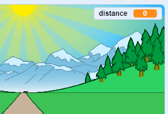

## Parcourir la distance

Déplaçons la ligne d'arrivée lorsque les touches fléchées sont enfoncées.

--- task ---

Tu veux permettre au joueur d'appuyer sur les touches fléchées __jusqu'à ce qu'il ait parcouru 100 mètres__ . Pour faire cela, crée une nouvelle variable appelée `distance`{:class="block3variables"}.

[[[generic-scratch3-add-variable]]]

--- /task ---

--- task ---

Tu devrais voir ta nouvelle variable sur la scène. Fais-la glisser dans le coin supérieur droit.



--- /task ---

--- task ---

Définis la `distance`{:class="block3variables"} à 0 lorsque le drapeau est cliqué.


```blocks3
when green flag clicked
+set [distance v] to [0]
go to x: (0) y: (30)
set size to (1) %
```

--- /task ---

--- task ---

Une fois que ta course commence, ton joueur devrait sprinter __jusqu'à ce qu'il ait parcouru 100 mètres__.


```blocks3
when I receive [start v]
repeat until <(distance :: variables) = [100]>
end 
```

--- /task ---

--- task ---

Ajoute du code pour que ta ligne d'arrivée devienne un peu plus grande après que le joueur appuie sur la touche fléchée gauche. La distance devrait également augmenter.


```blocks3
when I receive [start v]
repeat until <(distance :: variables) = [100]>
+wait until <key (left arrow v) pressed?>
+ change size by (1)
+ change [distance v] by (1)
end 
```

--- /task ---

--- task ---

Clique sur le drapeau vert pour tester ton projet. Tu devrais voir que la ligne d'arrivée devient plus grande lorsque la flèche gauche est enfoncée, mais qu'elle ne bouge pas le long de la piste.


--- /task ---

--- task ---

Pour corriger cela, tu peux ajouter du code pour déplacer légèrement la ligne d'arrivée vers le bas chaque fois qu'une touche est pressée.


```blocks3
when I receive [start v]
repeat until <(distance :: variables) = [100]>
wait until <key (left arrow v) pressed?>
change size by (1)
+change y by (-1.5)
change [distance v] by (1)
end 
```

--- /task ---

--- task ---

Teste à nouveau ton projet et tu devrais voir la ligne d'arrivée descendre la scène vers toi.


--- /task ---

--- task ---

Tu devrais alors faire la même chose pour la touche fléchée droite.


```blocks3
when I receive [start v]
repeat until <(distance :: variables) = [100]>
wait until <key (left arrow v) pressed?>
change size by (1)
change y by (-1.5)
change [distance v] by (1)
+wait until <key (right arrow v) pressed?>
+change size by (1)
+change y by (-1.5)
+change [distance v] by (1)
end 
```

--- /task ---

--- task ---

Si tu cliques pour voir les costumes de la ligne d'arrivée, tu devrais voir qu'il y en a 2.


--- /task ---

--- task ---

Tu peux passer au costume 'cassé' (et terminer le jeu) à la fin de la course. N'oublie pas de passer au costume « normal » au début de la course !


```blocks3
when I receive [start v]
repeat until <(distance :: variables) = [100]>
wait until <key (left arrow v) pressed?>
change size by (1)
change y by (-1.5)
change [distance v] by (1)
wait until <key (right arrow v) pressed?>
change size by (1)
change y by (-1.5)
change [distance v] by (1)
end 
+switch costume to (cassé v)
+stop [all v]
```

```blocks3
when green flag clicked
+switch costume to (normal v)
set [distance v] to [0]
```

--- /task ---

--- task ---

Si tu veux jouer un son à la fin, tu auras changé ton bloc `stop`{:class="block3control"} en `autres scripts dans le sprite`{:class="block3control"}.

Cela signifie que le chronomètre que tu vas créer arrêtera de compter, mais le son continuera de jouer.


```blocks3
switch costume to (cassé v)
+ stop [other scripts in sprite v]
+ start sound (cheer v)
```

--- /task ---

As-tu remarqué que tu peux tromper le jeu en conservant pressées les touches fléchées gauche et droite ?

--- task ---

Pour corriger cela, tu dois t'assurer que chaque touche est appuyée __puis relachée__ avant de déplacer la ligne d'arrivée.

Voici le code que tu devras ajouter :


```blocks3
wait until <key (left arrow v) pressed?>
+wait until <not <key (left arrow v) pressed?>>
change size by (1)
```

Tu devras faire la même chose pour la touche fléchée droite.


```blocks3
wait until <not <key (right arrow v) pressed?>>
```

--- /task ---
