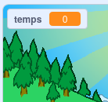
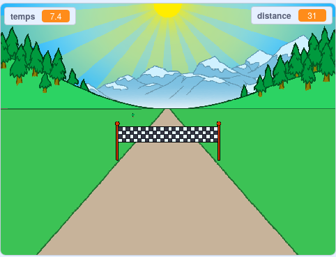

## Qui est le plus rapide ?

Ajoutons un chronomètre à ton jeu, pour voir qui peut courir le plus vite.

--- task ---

Crée une nouvelle variable `temps`{:class="block3variables"}. Elle apparaîtra sur la scène. Fais-la glisser dans le coin supérieur gauche.



--- /task ---

--- task ---

Régle le temps à 0 au début de la partie.


```blocks3
when green flag clicked
switch costume to (normal v)
set [distance v] to [0]
+ set [temps v] to [0]
go to x: (0) y: (30)
set size to (1) %
```

--- /task ---

--- task ---

Ajoute ce code pour que ton chronomètre commence à compter au démarrage du jeu.


```blocks3
when I receive [start v]
forever
wait (0.1) seconds
change [temps v] by (0.1)
end
```

--- /task ---

--- task ---

Teste ton projet en cliquant sur le drapeau vert. Tu devrais voir ton chronomètre compter jusqu'à ce que tu aies couru 100 mètres.



--- /task ---

