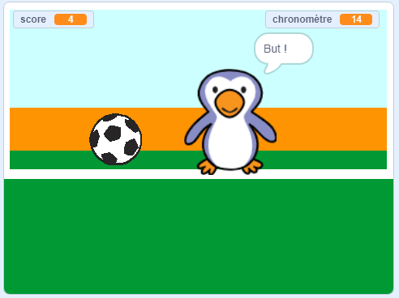

## Et ensuite ?

Jette un œil au projet Scratch [Battre le gardien de but](https://projects.raspberrypi.org/en/projects/beat-the-goalie).

--- no-print ---

Clique sur le drapeau vert pour commencer. Utilise les touches fléchées gauche et droite pour contrôler le gardien de but et appuie sur <kbd>espace</kbd> pour frapper dans le ballon.

  <iframe allowtransparency="true" width="485" height="402" src="https://scratch.mit.edu/projects/embed/285942132/?autostart=false" frameborder="0" scrolling="no"></iframe>

--- /no-print ---

--- print-only ---

--- /print-only ---
