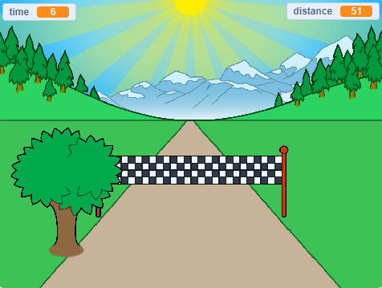

--- no-print ---

यह इस प्रोजेक्ट का **Scratch 3** वर्ज़न (version) है। [इस प्रोजेक्ट का स्क्रैच २ (Scratch 2) संस्करण](https://projects.raspberrypi.org/en/projects/sprint-scratch2) भी है।

--- /no-print ---

## परिचय

आप अपना स्वयं का स्प्रिंट गेम बनाने का तरीका जानने जा रहे हैं, जिसमें आपको जितनी जल्दी हो सके फिनिश लाइन को पाने के लिए बाएं और दाएं एरो बटन्स का उपयोग करना होगा।

--- no-print ---

  <iframe allowtransparency="true" width="485" height="402" src="https://scratch.mit.edu/projects/embed/298930696/?autostart=false" frameborder="0" scrolling="no"></iframe>
  

--- /no-print ---

--- print-only ---

--- /print-only ---

--- collapse ---
---
title: आपको किन चीजों की आवश्यकता होगी
---

### हार्डवेयर

+ Scratch चलाने में सक्षम कंप्यूटर

### सॉफ्टवेयर

+ Scratch 3 (या तो [online](http://rpf.io/scratchon){:target="_blank"} या [offline](http://rpf.io/scratchoff){:target="_blank"})

### डाउनलोड

स्टार्टर प्रोजेक्ट यहाँ पाया जा सकता है[here](http://rpf.io/p/en/sprint-go){:target="_blank"}.

--- /collapse ---

--- collapse ---
---
title: आप क्या सीखेंगे
---

- स्प्राइट्स (sprites) को एनिमेटे कैसे करते है
- कीबोर्ड इनपुट का उपयोग कैसे करें
- Broadcasts (ब्राडकास्ट) का उपयोग कैसे करते है

--- /collapse ---

--- collapse ---
---
title: शिक्षकों के लिए अतिरिक्त जानकारी
---

--- no-print ---

अगर आपको इस प्रोजेक्ट को प्रिंट करने की आवश्यकता है, तो कृप्या [printer-friendly version](https://projects.raspberrypi.org/en/projects/sprint/print){: target = "_ blank"} का उपयोग करें।

--- /no-print ---

आप इस प्रोजेक्ट का कम्पलीट वर्शन  [completed project here](http://rpf.io/p/en/sprint-get){:target="_blank"} देख सकते है।

--- /collapse ---

