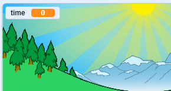
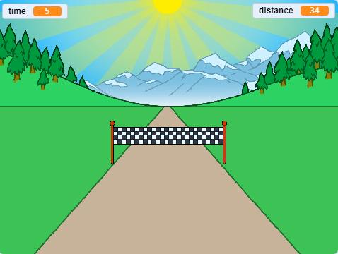

## सबसे तेज कौन है?

आइए अपने गेम में एक टाइमर जोड़ें, यह देखने के लिए कि कौन सबसे तेज़ स्प्रिंट कर सकता है।

--- task ---

एक नया  `time`{:class="block3variables"}  चर (variable)बनाएँ । सूची मंच पर दिखाई देगी। इसे ऊपरी-बाएँ कोने में खींचें।



--- /task ---

--- task ---

अपने गेम की शुरुआत में 0 से समय शुरू करें।


```blocks3
when green flag clicked
switch costume to (normal v)
set [distance v] to [0]
+ set [time v] to [0]
go to x: (0) y: (30)
set size to (1) %
```

--- /task ---

--- task ---

खेल शुरू होने पर अपने टाइमर को गिनने के लिए इस कोड को जोड़ें।


```blocks3
when I receive [start v]
forever
wait (0.1) seconds
change [time v] by (0.1)
end
```

--- /task ---

--- task ---

हरे झंडे पर क्लिक करके अपने प्रोजेक्ट का परीक्षण करें। जब तक आप 100 मीटर की दूरी पर नहीं जाते तब तक आपको अपना टाइमर देखना चाहिए।



--- /task ---

