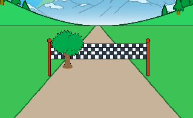

## दृश्य जोड़ना

खिलाड़ी स्प्रिंट की तरह हिलने के लिए एक पेड़ को कोड करते हैं।

--- task ---

सबसे पहले, पेड़ को स्थिति दें और ध्वज को क्लिक करने पर इसे छोटा करें।


```blocks3
when green flag clicked
show
go to x: (-50) y: (20)
set size to (1) %
```

--- /task ---


--- task ---

एक बार दौड़ शुरू होने के बाद, पेड़ को तब तक हिलना चाहिए जब तक खिलाड़ी 100 मीटर तक उछल न जाए।


```blocks3
when I receive [start v]
repeat until <(distance :: variables) = [100]>
end

```

--- /task ---

--- task ---

एक बार जब बाईं की को दबाया जाता है (और जारी किया जाता है), पेड़ को बड़ा होना चाहिए और आगे बढ़ना चाहिए - जैसे फिनिश लाइन।


```blocks3
when I receive [start v]
repeat until <(distance :: variables) = [100]>
+wait until <key (left arrow v) pressed?>
+wait until <not  <key (left arrow v) pressed?>>
+change size by (1)
+change y by (-1.5)
end
```

--- /task ---

--- task ---

यदि आप अपने पेड़ का परीक्षण करते हैं, तो आप देखेंगे कि यह ट्रैक पर नीचे की ओर बढ़ता है।



--- /task ---

--- task ---

इसे ठीक करने के लिए, अपने पेड़ को ट्रैक से थोड़ा दूर ले जाने के लिए कोड जोड़ें।


```blocks3
when I receive [start v]
repeat until <(distance :: variables) = [100]>
wait until <key (left arrow v) pressed?>
wait until <not  <key (left arrow v) pressed?>>
change size by (1)
change y by (-1.5)
+change x by (-2)
end
```

--- /task ---

--- task ---

आपको सही एरो की के लिए भी ऐसा ही करना चाहिए। यहाँ दिखाया गया है कि आपका पेड़ का कोड कैसा दिखेगा:


```blocks3
when green flag clicked
show
go to x: (-50) y: (20)
set size to (1) %

when I receive [start v]
repeat until <(distance :: variables) = [100]>
wait until <key (left arrow v) pressed?>
wait until <not  <key (left arrow v) pressed?>>
change size by (1)
change y by (-1.5)
change x by (-2)
wait until <key (right arrow v) pressed?>
wait until <not  <key (right arrow v) pressed?>>
change size by (1)
change y by (-1.5)
change x by (-2)
end
```

--- /task ---

