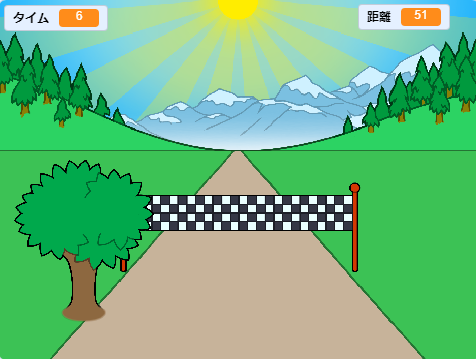

--- no-print ---

これはプロジェクトの**Scratch 3**バージョンです。 [Scratch 2バージョンのプロジェクト](https://projects.raspberrypi.org/en/projects/sprint-scratch2)もあります。

--- /no-print ---

## はじめに

100メートル走ゲームの作り方を学びます。左右の矢印 (やじるし) キーを使ってできるだけ早くゴールするゲームです。

--- no-print ---

  <iframe allowtransparency="true" width="485" height="402" src="https://scratch.mit.edu/projects/embed/298930696/?autostart=false" frameborder="0" scrolling="no"></iframe>
  

--- /no-print ---

--- print-only ---

--- /print-only ---

--- collapse ---
---
title: 必要（ひつよう）なもの
---

### ハードウェア

+ Scratch を実行できるコンピュータ

### ソフトウェア

+ Scratch 3 ([オンライン](http://rpf.io/scratchon){:target="_blank"}または[オフライン](http://rpf.io/scratchoff){:target="_blank"})

### ダウンロード

基本 (きほん) のプロジェクトは [こちら](http://rpf.io/p/en/sprint-go){:target="_blank"}にあります。

--- /collapse ---

--- collapse ---
---
title: 学ぶこと
---

- スプライトの動かし方
- キーボード入力の使い方
- メッセージの使い方

--- /collapse ---

--- collapse ---
---
title：教育者向けの追加情報
---

--- no-print ---

このプロジェクトを印刷する必要がある場合は、 [印刷用バージョン](https://projects.raspberrypi.org/en/projects/sprint/print){:target="_ blank"}を使用してください。

--- /no-print ---

[完成したプロジェクトはこちら](http://rpf.io/p/en/sprint-get){:target="_blank"}にあります。

--- /collapse ---

