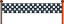

## 位置 (いち) について...

レースの秒読みを作ることから始めましょう。

--- task ---

「100メートル走」の基本 (きほん) のプロジェクトを開きます。

**オンライン**: [基本のプロジェクト](http://rpf.io/sprint-on){:target="_blank"}を開きます。

Scratch アカウントを持っている場合は、 **リミックス**ボタンをクリックしてプロジェクトをコピーできます。

**オフライン**: オフラインエディターで[基本のプロジェクト](http://rpf.io/p/en/sprint-go){:target="_blank"}を開きます。

[rpf.io/scratchoff](http://rpf.io/scratchoff){:target="_blank"}から Scratch オフラインエディターをダウンロードしてインストールできます。

基本のプロジェクトを開くと、直線コースとゴールが表示 (ひょうじ) されます。


--- /task ---

--- task ---

まず、ゴールを水平線上におきます。



```blocks3
when green flag clicked
go to x: (0) y: (30)
set size to (1) %
```

--- /task ---

--- task ---

緑の旗 (はた) をクリックしてコードをテストすると、ゴールがはるか遠くに表示されます。


--- /task ---

--- task ---

Next, use `say`{:class="block3looks"} blocks to create a countdown, and then broadcast a `start`{:class="block3events"} message.


```blocks3
when green flag clicked
go to x: (0) y: (30)
set size to (1) %
+say [3] for (1) seconds
+say [2] for (1) seconds
+say [1] for (1) seconds
+broadcast (start v)
```

--- /task ---

--- task ---

You can also add a sound to your countdown.


```blocks3
when green flag clicked
go to x: (0) y: (30)
set size to (1) %
say [3] for (1) seconds
say [2] for (1) seconds
say [1] for (1) seconds
+start sound (Siren Whistle v)
broadcast (start v)
```

--- /task ---
