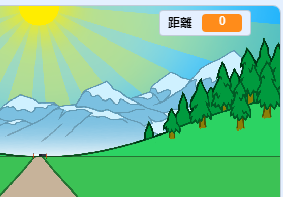
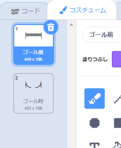

## ゴールまで走る

矢印キーが押された (おされた) ときにゴールを動かしましょう。

--- task ---

プレーヤーが__100メートル走りきるまで__矢印キーを押せるようにします 。 そのために、`距離`{:class="block3variables"} (きょり) という新しい変数 (へんすう) を作ります。

[[[generic-scratch3-add-variable]]]

--- /task ---

--- task ---

ステージ上に新しい変数が表示されます。 それを右上のすみにドラッグします。



--- /task ---

--- task ---

緑の旗が押されたとき、`距離`{:class="block3variables"}を0にします。


```blocks3
when green flag clicked
+set [distance v] to [0]
go to x: (0) y: (30)
set size to (1) %
```

--- /task ---

--- task ---

レースが始まったら、プレーヤーは__100メートルの距離を__全力で走らなければなりません。


```blocks3
when I receive [start v]
repeat until <(distance :: variables) = [100]>
end 
```

--- /task ---

--- task ---

コードを追加して、プレイヤーが左矢印キーを押したら、ゴールが少し大きくなるようにします。 走った距離もふやします。


```blocks3
when I receive [start v]
repeat until <(distance :: variables) = [100]>
+wait until <key (left arrow v) pressed?>
+ change size by (1)
+ change [distance v] by (1)
end 
```

--- /task ---

--- task ---

緑の旗をクリックしてプロジェクトをテストします。 左矢印キーが押されるとゴールは大きくなりますが、コースにそって動いてはくれません。


--- /task ---

--- task ---

これをなおすには、キーが押されるたびにゴールを少し下に移動 (いどう) するコードを追加します。


```blocks3
when I receive [start v]
repeat until <(distance :: variables) = [100]>
wait until <key (left arrow v) pressed?>
change size by (1)
+change y by (-1.5)
change [distance v] by (1)
end 
```

--- /task ---

--- task ---

もう一度プロジェクトをテストすると、ゴールが自分に向かって、ステージの下に移動するのがわかります。


--- /task ---

--- task ---

You should then do the same for the right arrow key.


```blocks3
when I receive [start v]
repeat until <(distance :: variables) = [100]>
wait until <key (left arrow v) pressed?>
change size by (1)
change y by (-1.5)
change [distance v] by (1)
+wait until <key (right arrow v) pressed?>
+change size by (1)
+change y by (-1.5)
+change [distance v] by (1)
end 
```

--- /task ---

--- task ---

If you click to see the finish line's costumes, you should see that there are 2.



--- /task ---

--- task ---

You can switch to the 'broken' costume (and end the game) at the end of the race. Remember to switch to the 'normal' costume at the start of the race!


```blocks3
when I receive [start v]
repeat until <(distance :: variables) = [100]>
wait until <key (left arrow v) pressed?>
change size by (1)
change y by (-1.5)
change [distance v] by (1)
wait until <key (right arrow v) pressed?>
change size by (1)
change y by (-1.5)
change [distance v] by (1)
end 
+switch costume to (broken v)
+stop [all v]
```

```blocks3
when green flag clicked
+switch costume to (normal v)
set [distance v] to [0]
```

--- /task ---

--- task ---

If you want to play a sound at the end, you'll have change your `stop all`{:class="block3control"} block to `stop other scripts in sprite`{:class="block3control"}.

This means that the timer you'll create will stop counting, but the sound will still play.


```blocks3
switch costume to (broken v)
+ stop [other scripts in sprite v]
+ start sound (cheer v)
```

--- /task ---

Have you noticed that you can cheat your game by just holding down the left and right arrow keys?

--- task ---

To fix this, you need to make sure that each key is pressed __and then released__ before moving the finish line.

Here's the code you'll need to add:


```blocks3
wait until <key (left arrow v) pressed?>
+wait until <not <key (left arrow v) pressed?>>
change size by (1)
```

You'll need to do the same for the right arrow key.


```blocks3
wait until <not <key (right arrow v) pressed?>>
```

--- /task ---
