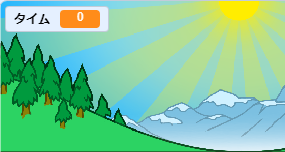
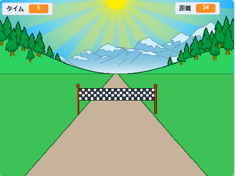

## 一番速いのはだれですか？

ゲームにタイマーを追加して、だれが一番速く走れるかをきそいましょう。

--- task ---

新しく`タイム`{:class="block3variables"}変数を作ります。 この変数はステージ上に表示されます。 変数を左上のすみにドラッグします。



--- /task ---

--- task ---

ゲーム開始時にタイムを0にします。


```blocks3
when green flag clicked
switch costume to (ゴール前 v)
set [距離 v] to [0]
+ set [タイム v] to [0]
go to x: (0) y: (30)
set size to (1) %
```

--- /task ---

--- task ---

ゲームが始まったらタイマーがカウントアップするコードを追加します。


```blocks3
when I receive [スタート v]
forever
wait (0.1) seconds
change [タイム v] by (0.1)
end
```

--- /task ---

--- task ---

緑の旗をクリックしてプロジェクトをテストします。 100メートル走りきるまで、タイマーがカウントアップします。



--- /task ---

