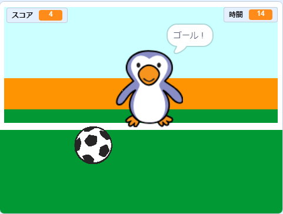

## 次は何をしましょうか？

Scratch プロジェクト[ゴールを決めろ](https://projects.raspberrypi.org/en/projects/beat-the-goalie)を見てみましょう。

--- no-print ---

緑の旗をクリックしてスタートします。 左右の矢印キーを使ってゴールキーパーを動かし、<kbd>スペースキー</kbd>を押してボールをけります。

  <iframe allowtransparency="true" width="485" height="402" src="https://scratch.mit.edu/projects/embed/285942132/?autostart=false" frameborder="0" scrolling="no"></iframe>

--- /no-print ---

--- print-only ---

--- /print-only ---
