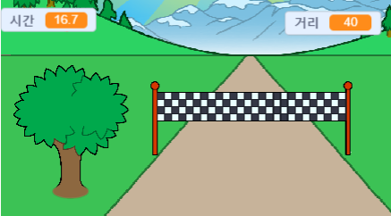

--- no-print ---

이 프로젝트의 **스크래치 3** 버전입니다. [프로젝트의 스크래치 2 버전](https://projects.raspberrypi.org/ko-KR/projects/sprint-scratch2)도 있습니다.

--- /no-print ---

## 들어가며

결승선에 빨리 도달하기 위해 왼쪽 및 오른쪽 화살표 키를 사용하는 여러분만의 전력질주 게임을 만드는 방법을 배우게 될 것입니다.

--- no-print ---

  <iframe allowtransparency="true" width="485" height="402" src="https://scratch.mit.edu/projects/embed/420624378/?autostart=false" frameborder="0" scrolling="no"></iframe>
  

--- /no-print ---

--- print-only ---

--- /print-only ---

--- collapse ---
---
title: 준비물
---

### 하드웨어

+ 스크래치를 실행할 수 있는 컴퓨터

### 소프트웨어

+ 스크래치 3 ( [온라인](http://rpf.io/scratchon){:target="_blank"} 또는 [offline](http://rpf.io/scratchoff){:target="_blank"})

### 다운로드 목록

스타터 프로젝트는 [여기](http://rpf.io/p/ko-KR/sprint-go){:target="_blank"}를 클릭하면 열 수 있습니다.

--- /collapse ---

--- collapse ---
---
title: 배우게 될 것
---

- 스프라이트를 움직이는 방법
- 키보드 입력을 사용하는 방법
- 방송하기를 사용하는 방법

--- /collapse ---

--- collapse ---
---
title: 교육자를 위한 추가 정보
---

--- no-print ---

이 프로젝트를 인쇄하려면, [프린트용 버전](https://projects.raspberrypi.org/ko-KR/projects/sprint/print){:target="_blank"}을 사용하십시오.

--- /no-print ---

여기서 [완료된 프로젝트](http://rpf.io/p/ko-KR/sprint-get){:target="_blank"}.를 확인할 수 있습니다.

--- /collapse ---

