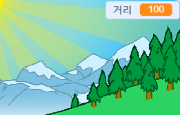
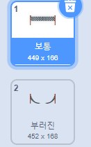

## 거리를 통과하다

화살표 키를 누르면 결승선으로 이동합니다.

--- task ---

__플레이어들이 100미터를 뛸 동안__ 화살표 키를 누르도록 해야 합니다. 그러기 위해, `거리`{:class="block3variables"}라고 불리는 변수를 새로 만드세요.

[[[generic-scratch3-add-variable]]]

--- /task ---

--- task ---

무대에서 새로운 변수를 볼 수 있습니다. 오른쪽 상단으로 끕니다.



--- /task ---

--- task ---

깃발을 누를때 `거리`{:class="block3variables"}가 0이 되도록 설정합니다.


```blocks3
when green flag clicked
+set [거리 v] to [0]
go to x: (0) y: (30)
set size to (1) %
```

--- /task ---

--- task ---

레이스가 시작되면 플레이어는 __100 미터를 달릴 때까지__ 전력질주해야합니다.


```blocks3
when I receive [시작 v]
repeat until <(거리 :: variables) = [100]>
end 
```

--- /task ---

--- task ---

플레이어가 왼쪽 화살표 키를 누를동안 결승선이 약간 커지도록 코드를 추가하십시오. 거리도 증가해야합니다.


```blocks3
when I receive [시작 v]
repeat until <(거리 :: variables) = [100]>
+wait until <key (left arrow v) pressed?>
+ change size by (1)
+ change [거리 v] by (1)
end 
```

--- /task ---

--- task ---

녹색 깃발을 눌러 시작합니다. 왼쪽 화살표를 누르면 결승선이 커지지만 트랙을 따라 이동하지는 않습니다.


--- /task ---

--- task ---

이 문제를 해결하기 위해 키를 누를 때마다 결승선을 약간 아래로 이동하는 코드를 추가 할 수 있습니다.


```blocks3
when I receive [시작 v]
repeat until <(거리 :: variables) = [100]>
wait until <key (left arrow v) pressed?>
change size by (1)
+change y by (-1.5)
change [거리 v] by (1)
end 
```

--- /task ---

--- task ---

프로젝트를 다시 테스트하면 결승선이 자신을 향해 점점 아래로 이동하는 것을 볼 수 있습니다.


--- /task ---

--- task ---

그런 다음 오른쪽 화살표 키에 대해서도 동일하게 수행해야 합니다.


```blocks3
when I receive [시작 v]
repeat until <(거리 :: variables) = [100]>
wait until <key (left arrow v) pressed?>
change size by (1)
change y by (-1.5)
change [거리 v] by (1)
+wait until <key (right arrow v) pressed?>
+change size by (1)
+change y by (-1.5)
+change [거리 v] by (1)
end 
```

--- /task ---

--- task ---

결승선의 모양을 클릭하면 2개를 볼수 있습니다.



--- /task ---

--- task ---

레이스가 끝나면 '깨진'모양으로 전환하고 게임을 종료 할 수 있습니다. 레이스가 시작될 때 '보통'의상으로 전환해야 합니다!


```blocks3
when I receive [시작 v]
repeat until <(거리 :: variables) = [100]>
wait until <key (left arrow v) pressed?>
change size by (1)
change y by (-1.5)
change [거리 v] by (1)
wait until <key (right arrow v) pressed?>
change size by (1)
change y by (-1.5)
change [거리 v] by (1)
end 
+switch costume to (깨짐 v)
+stop [all v]
```

```blocks3
when green flag clicked
+switch costume to (보통 v)
set [거리 v] to [0]
```

--- /task ---

--- task ---

마지막에 소리를 재생하려면 `모두 중지`{:class="block3control"}블럭을 `스프라이트 안에 있는 다른 스크립트 중지`{:class="block3control"}블럭으로 바꿔야 합니다.

이것은 당신이 만들 타이머는 카운트를 멈추지만 사운드는 여전히 재생됨을 의미합니다.


```blocks3
switch costume to (깨짐 v)
+ stop [other scripts in sprite v]
+ start sound (cheer v)
```

--- /task ---

왼쪽 및 오른쪽 화살표 키만 누르고 있으면 게임을 통과 할수 있다는 것을 알고 있습니까?

--- task ---

이 문제를 해결하려면 결승선을 이동하기 전에 각 키를 __눌렀다가 놓아야 합니다__.

필요한 코드는 다음과 같습니다:


```blocks3
wait until <key (left arrow v) pressed?>
+wait until <not <key (left arrow v) pressed?>>
change size by (1)
```

그런 다음 오른쪽 화살표 키에 대해서도 동일하게 수행해야 합니다.


```blocks3
wait until <not <key (right arrow v) pressed?>>
```

--- /task ---
