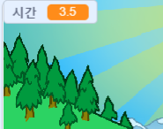
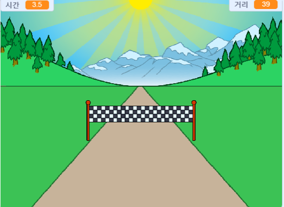

## 누가 가장 빠릅니까?

누가 가장 빠르게 전력질주 할 수 있는지 알아보기 위해 게임에 타이머를 추가해 보겠습니다.

--- task ---

새 변수`시간`{:class="block3variables"}를 만들고 '지연 시간'이라는 이름을 붙이세요 무대에 나타납니다. 오른쪽 상단으로 끕니다.



--- /task ---

--- task ---

게임을 시작할 때 시간을 0으로 설정하십시오.


```blocks3
when green flag clicked
switch costume to (normal v)
set [distance v] to [0]
+ set [time v] to [0]
go to x: (0) y: (30)
set size to (1) %
```

--- /task ---

--- task ---

게임이 시작될 때 타이머를 카운트하려면 이 코드를 추가하십시오.


```blocks3
when I receive [start v]
forever
wait (0.1) seconds
change [time v] by (0.1)
end
```

--- /task ---

--- task ---

녹색 깃발을 클릭하여 프로젝트를 테스트 해보세요. 100 미터를 전력질주 할 때까지 타이머가 작동하는 것을 볼 수 있습니다.



--- /task ---

