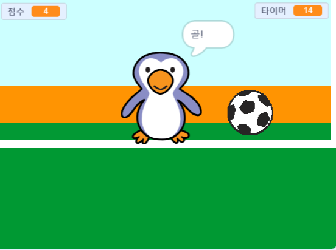

## 더 나아가기

[골키퍼를 이겨라](https://projects.raspberrypi.org/en/projects/beat-the-goalie) 스크래치 프로젝트를 보세요.

--- no-print ---

녹색 깃발을 눌러 시작합니다. 왼쪽 및 오른쪽 화살표 키를 사용하여 골키퍼를 제어하고 공을 차기 위해 <kbd>스페이스</kbd>를 누르세요

  <iframe allowtransparency="true" width="485" height="402" src="https://scratch.mit.edu/projects/embed/285942132/?autostart=false" frameborder="0" scrolling="no"></iframe>

--- /no-print ---

--- print-only ---

--- /print-only ---
