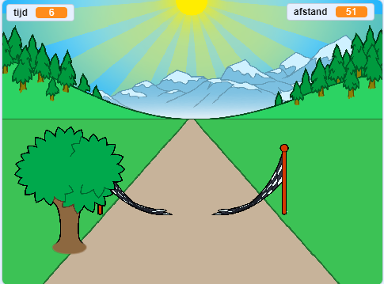

--- no-print ---

Dit is de **Scratch 3** versie van het project. Er is ook een [Scratch 2 versie van dit project](https://projects.raspberrypi.org/nl-NL/projects/sprint-scratch2).

--- /no-print ---

## Inleiding

Je leert hoe je je eigen sprintspel maakt, waarbij je de linker- en rechterpijltoetsen moet gebruiken om zo snel mogelijk naar de finish te komen.

--- no-print ---

  <iframe allowtransparency="true" width="485" height="402" src="https://scratch.mit.edu/projects/embed/406225699/?autostart=false" frameborder="0" scrolling="no"></iframe>
  

--- /no-print ---

--- print-only ---

--- /print-only ---

--- collapse ---
---
title: Wat heb je nodig
---

### Hardware

+ Een computer die Scratch kan uitvoeren

### Software

+ Scratch 3 ([online](http://rpf.io/scratchon){:target="_blank"} of [offline](http://rpf.io/scratchoff){:target="_blank"})

### Downloads

Het startproject kan [hier](http://rpf.io/p/nl-NL/sprint-go){:target="_blank"} gevonden worden.

--- /collapse ---

--- collapse ---
---
title: Wat ga je leren
---

- Hoe sprites te animeren
- Hoe gebruik je toetsenbordinvoer
- Hoe berichten te gebruiken

--- /collapse ---

--- collapse ---
---
title: Aanvullende informatie voor docenten
---

--- no-print ---

Als je dit project wilt afdrukken, gebruik dan de [printervriendelijke versie](https://projects.raspberrypi.org/nl-NL/projects/sprint/print){:target="_blank"}.

--- /no-print ---

Je kunt het [voltooide project hier](http://rpf.io/p/nl-NL/sprint-get){:target="_blank"} vinden.

--- /collapse ---

