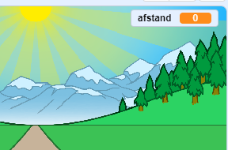
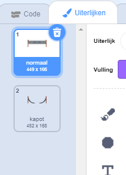

## De afstand afleggen

Laten we de eindstreep verplaatsen als de pijltjestoetsen worden ingedrukt.

--- task ---

Je wilt de speler toestaan om op de pijltjestoetsen te drukken __totdat ze 100 meter hebben afgelegd__. Maak hiervoor een nieuwe variabele met de naam `afstand`{:class="block3variables"}.

[[[generic-scratch3-add-variable]]]

--- /task ---

--- task ---

Je zou je nieuwe variabele op het speelveld moeten zien. Sleep het naar de rechterbovenhoek.



--- /task ---

--- task ---

Stel de `afstand`{:class="block3variables"} in op 0 wanneer op de vlag wordt geklikt.


```blocks3
when green flag clicked
+set [afstand v] to [0]
go to x: (0) y: (30)
set size to (1) %
```

--- /task ---

--- task ---

Zodra je race begint, moet je speler sprinten __totdat ze 100 meter hebben gerend__.


```blocks3
when I receive [start v]
repeat until <(afstand :: variables) = [100]>
end 
```

--- /task ---

--- task ---

Voeg code toe zodat je eindstreep een beetje groter wordt nadat de speler op de linkerpijltoets heeft gedrukt. De afstand moet ook groter worden.


```blocks3
when I receive [start v]
repeat until <(afstand :: variables) = [100]>
+wait until <key (left arrow v) pressed?>
+ change size by (1)
+ change [afstand v] by (1)
end 
```

--- /task ---

--- task ---

Klik op de groene vlag om je project te testen. Je zou moeten zien dat de eindstreep groter wordt wanneer de linkerpijl wordt ingedrukt, maar niet beweegt over de weg.


--- /task ---

--- task ---

Om dit op te lossen, kun je code toevoegen om de eindstreep elke keer dat je op een toets drukt iets naar beneden te verplaatsen.


```blocks3
when I receive [start v]
repeat until <(afstand :: variables) = [100]>
wait until <key (left arrow v) pressed?>
change size by (1)
+change y by (-1.5)
change [afstand v] by (1)
end 
```

--- /task ---

--- task ---

Test je project opnieuw en je zou de eindstreep over het speelveld naar je toe moeten zien bewegen.


--- /task ---

--- task ---

Je moet dan hetzelfde doen voor de rechterpijltoets.


```blocks3
when I receive [start v]
repeat until <(afstand :: variables) = [100]>
wait until <key (left arrow v) pressed?>
change size by (1)
change y by (-1.5)
change [afstand v] by (1)
+wait until <key (right arrow v) pressed?>
+change size by (1)
+change y by (-1.5)
+change [afstand v] by (1)
end 
```

--- /task ---

--- task ---

Als je klikt om de uiterlijken van de eindstreep te zien, zou je moeten zien dat er 2 zijn.



--- /task ---

--- task ---

Je kunt overschakelen naar het 'kapot' uiterlijk (en het spel beëindigen) aan het einde van de race. Vergeet niet om aan het begin van de race naar het 'normaal' uiterlijk over te schakelen!


```blocks3
when I receive [start v]
repeat until <(afstand :: variables) = [100]>
wait until <key (left arrow v) pressed?>
change size by (1)
change y by (-1.5)
change [afstand v] by (1)
wait until <key (right arrow v) pressed?>
change size by (1)
change y by (-1.5)
change [afstand v] by (1)
end 
+switch costume to (kapot v)
+stop [all v]
```

```blocks3
when green flag clicked
+switch costume to (normaal v)
set [afstand v] to [0]
```

--- /task ---

--- task ---

Als je aan het einde een geluid wilt spelen, moet je je `stop alle`{:class="block3control"} blok wijzigen in `stop andere scripts in sprite`{:class="block3control"}.

Dit betekent dat de timer die je maakt zal stoppen met tellen maar het geluid blijft spelen.


```blocks3
switch costume to (kapot v)
+ stop [other scripts in sprite v]
+ start sound (cheer v)
```

--- /task ---

Is het je opgevallen dat je je spel kunt bedriegen door gewoon de linker- en rechterpijltoetsen ingedrukt te houden?

--- task ---

Om dit te verhelpen, moet je ervoor zorgen dat elke toets wordt ingedrukt __en vervolgens losgelaten__ voordat je de eindstreep verplaatst.

Hier is de code die je moet toevoegen:


```blocks3
wait until <key (left arrow v) pressed?>
+wait until <not <key (left arrow v) pressed?>>
change size by (1)
```

Je moet dan hetzelfde doen voor de rechterpijltoets.


```blocks3
wait until <not <key (right arrow v) pressed?>>
```

--- /task ---
