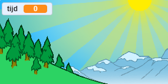
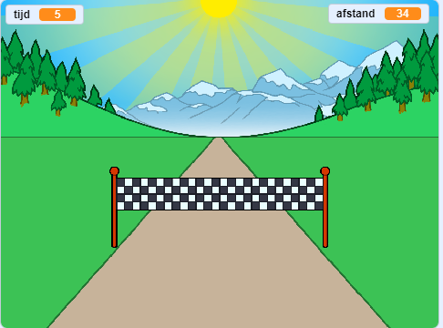

## Wie is de snelste?

Laten we een timer aan je spel toevoegen om te zien wie het snelst kan sprinten.

--- task ---

Maak een nieuwe `tijd`{:class="block3variables"} variabele. Het zal op het speelveld verschijnen. Sleep het naar de linkerbovenhoek.



--- /task ---

--- task ---

Stel de tijd aan het begin van je spel in op 0.


```blocks3
when green flag clicked
switch costume to (normaal v)
set [afstand v] to [0]
+ set [tijd v] to [0]
go to x: (0) y: (30)
set size to (1) %
```

--- /task ---

--- task ---

Voeg deze code toe om je timer te laten tellen wanneer het spel begint.


```blocks3
when I receive [start v]
forever
wait (0.1) seconds
change [tijd v] by (0.1)
end
```

--- /task ---

--- task ---

Test je project door op de groene vlag te klikken. Je zou moeten zien dat je timer optelt totdat je 100 meter hebt gesprint.



--- /task ---

