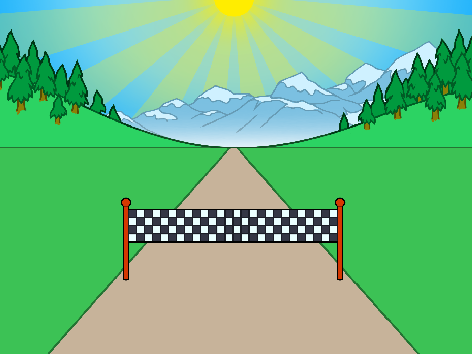

## Em suas marcas...

Vamos começar criando uma contagem regressiva para a corrida.

--- task ---

Abra o projeto inicial 'Corrida' do Scratch.

**Online**: open the [starter project](https://rpf.io/sprint-on){:target="_blank"}.

Se você tiver uma conta do Scratch, pode fazer uma cópia clicando em **Remix**.

**Offline**: open the [starter project](https://rpf.io/p/en/sprint-go){:target="_blank"} in the offline editor.

If you need to download and install the Scratch offline editor, you can find it at [rpf.io/scratchoff](https://rpf.io/scratchoff){:target="_blank"}.

No projeto inicial, você deve ver a pista e a linha de chegada.



--- /task ---

--- task ---

Para começar, vamos colocar a linha de chegada no horizonte:


```blocks3
when green flag clicked
go to x: (0) y: (30)
set size to (1) %
```

--- /task ---

--- task ---

Se você clicar na bandeira para testar seu código, verá sua linha de chegada à distância.


--- /task ---

--- task ---

Em seguida, use blocos `diga`{:class="block3looks"} para criar uma contagem regressiva, e então transmita uma mensagem `largar`{:class="block3events"}.


```blocks3
when green flag clicked
go to x: (0) y: (30)
set size to (1) %
+say [3] for (1) seconds
+say [2] for (1) seconds
+say [1] for (1) seconds
+broadcast (start v)
```

--- /task ---

--- task ---

Você também pode adicionar um som à sua contagem regressiva.


```blocks3
when green flag clicked
go to x: (0) y: (30)
set size to (1) %
say [3] for (1) seconds
say [2] for (1) seconds
say [1] for (1) seconds
+start sound (Siren Whistle v)
broadcast (start v)
```

--- /task ---
