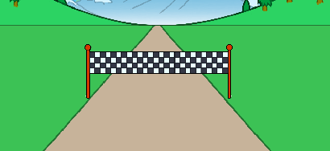

## Percorrendo a distância

Vamos mover a linha de chegada quando as setas no teclado forem pressionadas.

--- task ---

Você quer permitir que o jogador pressione as setas no teclado __até que ele tenha percorrido 100 metros__. Para fazer isso, crie uma nova variável chamada `distância`{:class="block3variables"}.

[[[generic-scratch3-add-variable]]]

--- /task ---

--- task ---

Você deve ver sua nova variável no palco. Arraste-a para o canto superior direito.


--- /task ---

--- task ---

Defina a `distância`{:class="block3variables"} para 0 quando a bandeira for clicada.


```blocks3
when green flag clicked
+set [distance v] to [0]
go to x: (0) y: (30)
set size to (1) %
```

--- /task ---

--- task ---

Assim que sua corrida começar, seu jogador deverá correr __até que ele tenha percorrido 100 metros__.


```blocks3
when I receive [start v]
repeat until <(distance :: variables) = [100]>
end 
```

--- /task ---

--- task ---

Adicione código para que sua linha de chegada fique um pouco maior depois que o jogador pressionar a seta para a esquerda no teclado. A distância deve também aumentar.


```blocks3
when I receive [start v]
repeat until <(distance :: variables) = [100]>
+wait until <key (left arrow v) pressed?>
+ change size by (1)
+ change [distance v] by (1)
end 
```

--- /task ---

--- task ---

Clique na bandeira verde para testar seu projeto. Você deve ver que a linha de chegada fica maior quando a seta para a esquerda é pressionada, mas não se move ao longo da faixa.


--- /task ---

--- task ---

Para corrigir isso, você pode adicionar um código para mover a linha de chegada, para baixo aos poucos, cada vez que uma tecla for pressionada.


```blocks3
when I receive [start v]
repeat until <(distance :: variables) = [100]>
wait until <key (left arrow v) pressed?>
change size by (1)
+change y by (-1.5)
change [distance v] by (1)
end 
```

--- /task ---

--- task ---

Teste seu projeto novamente e você poderá ver a linha de chegada se mover para baixo no palco e em sua direção.



--- /task ---

--- task ---

Você deve fazer o mesmo para seta para direita.


```blocks3
when I receive [start v]
repeat until <(distance :: variables) = [100]>
wait until <key (left arrow v) pressed?>
change size by (1)
change y by (-1.5)
change [distance v] by (1)
+wait until <key (right arrow v) pressed?>
+change size by (1)
+change y by (-1.5)
+change [distance v] by (1)
end 
```

--- /task ---

--- task ---

Se você clicar para ver as fantasias para a linha de chegada, deverá ver que há 2.


--- /task ---

--- task ---

Você pode mudar para a fantasia 'cortada' (e terminar o jogo) no final da corrida. Lembre-se de mudar para a fantasia 'normal' no início da corrida!


```blocks3
when I receive [start v]
repeat until <(distance :: variables) = [100]>
wait until <key (left arrow v) pressed?>
change size by (1)
change y by (-1.5)
change [distance v] by (1)
wait until <key (right arrow v) pressed?>
change size by (1)
change y by (-1.5)
change [distance v] by (1)
end 
+switch costume to (broken v)
+stop [all v]
```

```blocks3
when green flag clicked
+switch costume to (normal v)
set [distance v] to [0]
```

--- /task ---

--- task ---

Se você quiser tocar um som no final, você terá que mudar o seu bloco `pare todos`{:class="block3control"} para `pare outros scripts no ator`{:class="block3control"}.

Isso significa que o cronômetro que você criará vai interromper a contagem, mas o som ainda será reproduzido.


```blocks3
switch costume to (broken v)
+ stop [other scripts in sprite v]
+ start sound (cheer v)
```

--- /task ---

Você notou que consegue enganar seu jogo apenas segurando as setas para a esquerda ou para a direita no teclado?

--- task ---

Para corrigir isso, você precisa ter certeza de que cada tecla é pressionada __e depois liberada__ antes de mover a linha de chegada.

Aqui está o código que você precisará adicionar:


```blocks3
wait until <key (left arrow v) pressed?>
+wait until <not <key (left arrow v) pressed?>>
change size by (1)
```

Você precisará fazer o mesmo para a seta para a direita.


```blocks3
wait until <not <key (right arrow v) pressed?>>
```

--- /task ---
