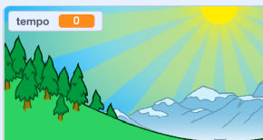
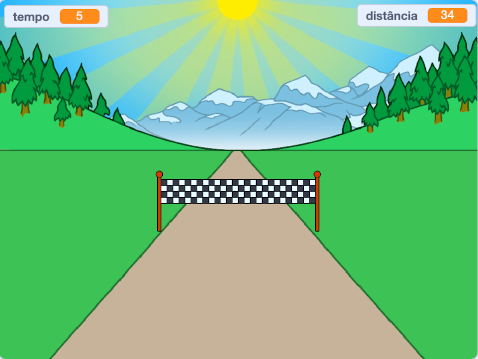

## Quem é o mais rápido?

Vamos adicionar um cronômetro ao seu jogo, para ver quem é o mais rápido na corrida.

--- task ---

Crie uma nova variável chamada `tempo`{:class="block3variables"}. Ela aparecerá no palco. Arraste-a para o canto superior esquerdo.



--- /task ---

--- task ---

Defina o tempo como 0 no início do seu jogo.


```blocks3
when green flag clicked
switch costume to (normal v)
set [distance v] to [0]
+ set [time v] to [0]
go to x: (0) y: (30)
set size to (1) %
```

--- /task ---

--- task ---

Adicione este código para fazer seu cronômetro contar quando o jogo iniciar.


```blocks3
when I receive [start v]
forever
wait (0.1) seconds
change [time v] by (0.1)
end
```

--- /task ---

--- task ---

Teste seu projeto clicando na bandeira verde. Você deve ver a contagem do seu cronômetro rodando até que você tenha percorrido 100 metros.



--- /task ---

