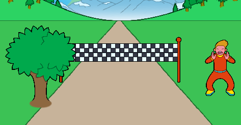

--- challenge ---

## Desafio: Adicione um espectador

Seu projeto inclui alguns atores espectador – clique no ícone 'mostrar' para exibir um deles no palco.

Você pode adicionar um espectador à sua corrida? Você consegue fazer o espectador vibrar quando você alcançar a linha de chegada?



Lembre-se de que o código que você precisará é muito parecido com o código que você já adicionou à sua linha de chegada e à sua árvore.

Aqui estão alguns blocos úteis de código para ajudá-lo:

```blocks3
when green flag clicked

set size to (1) %

go to x: (0) y: (0)

when I receive [start v]

repeat until <(distance :: variables) = [100]>
end

change x by (10)

change y by (10)

change size by (1)

wait until <key (left arrow v) pressed?>
```

Se você preferir, você pode adicionar outra árvore ou qualquer coisa que quiser!


--- /challenge ---