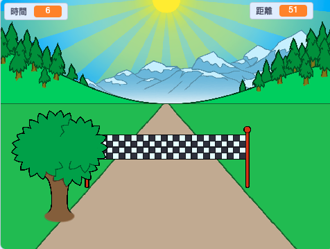

--- no-print ---

這個專案是 **Scratch 3** 版本。 另外還有 [Scratch 2](https://projects.raspberrypi.org/en/projects/sprint-scratch2) 版本。

--- /no-print ---

## 介紹

你會學到如何做出專屬你的賽跑小遊戲。交替用←→左右方向按鍵，就可全力衝刺到終點線。

--- no-print ---

  <iframe allowtransparency="true" width="485" height="402" src="https://scratch.mit.edu/projects/embed/298930696/?autostart=false" frameborder="0" scrolling="no"></iframe>
  

--- /no-print ---

--- print-only ---

--- /print-only ---

--- collapse ---
---
title: 你會用到
---

### 硬體

+ 可跑 Scratch 的電腦

### 軟體

+ Scratch 3 (either [online](https://rpf.io/scratchon){:target="_blank"} or [offline](https://rpf.io/scratchoff){:target="_blank"})

### 下載

The starter project can be found [here](https://rpf.io/p/en/sprint-go){:target="_blank"}.

--- /collapse ---

--- collapse ---
---
title: 你會學到
---

- 如何讓你的角色動起來
- 如何使用鍵盤輸入
- 如何使用廣播

--- /collapse ---

--- collapse ---
---
title: 給教師的其它資訊
---

--- no-print ---

如果你需要列印此專案，請使用[友善列印](https://projects.raspberrypi.org/en/projects/sprint/print)
{:target="_blank"}.

--- /no-print ---

You can find the [completed project here](https://rpf.io/p/en/sprint-get){:target="_blank"}.

--- /collapse ---

