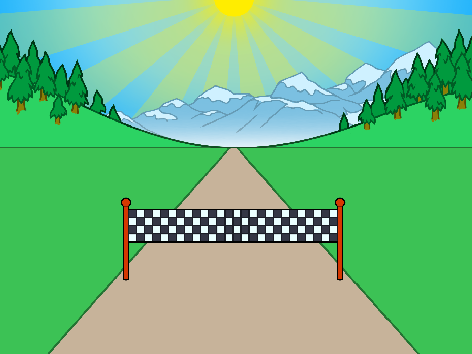

## 各就各位...

那我們就開始吧！建立比賽的倒數計時器。

--- task ---

打開 “全力衝刺” 這個專案的材料包。

**Online**: open the [starter project](https://rpf.io/sprint-on){:target="_blank"}.

如果你有 Scratch 帳戶，你可以透過點擊**Remix**來創建副本並進行改編。

**Offline**: open the [starter project](https://rpf.io/p/en/sprint-go){:target="_blank"} in the offline editor.

If you need to download and install the Scratch offline editor, you can find it at [rpf.io/scratchoff](https://rpf.io/scratchoff){:target="_blank"}.

在入門專案中，你會看到一個跑道和終點線。



--- /task ---

--- task ---

首先，將終點線放置在水平面上。


```blocks3
when green flag clicked
go to x: (0) y: (30)
set size to (1) %
```

--- /task ---

--- task ---

讓我們來測試你寫的程式。試試點擊綠色的旗子，你應該可以看到在遠處的終點線。


--- /task ---

--- task ---

接下來，使用 `說出` {：class =“ block3looks”}積木來建立倒數計時器，然後廣播`開始` {：class =“ block3events”}訊號。


```blocks3
when green flag clicked
go to x: (0) y: (30)
set size to (1) %
+say [3] for (1) seconds
+say [2] for (1) seconds
+say [1] for (1) seconds
+broadcast (start v)
```

--- /task ---

--- task ---

你還可以另外添加音效在你的倒數計時器上。


```blocks3
when green flag clicked
go to x: (0) y: (30)
set size to (1) %
say [3] for (1) seconds
say [2] for (1) seconds
say [1] for (1) seconds
+start sound (Siren Whistle v)
broadcast (start v)
```

--- /task ---
