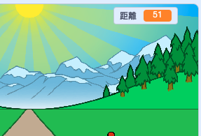
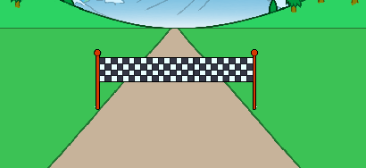
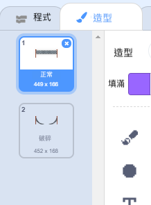

## 即將跑完全程

當鍵盤左右方向鍵交替按鍵，讓我們離終點線更近。

--- task ---

玩家可以按壓鍵盤的左右方向鍵，__直到他們跑完100米__ 。 要做到這個，你要先創建一個新變數，將它命名為`距離`{:class="block3variables"}。

[[[generic-scratch3-add-variable]]]

--- /task ---

--- task ---

你會在舞台上看到新的變數。 拖曳到右上角。



--- /task ---

--- task ---

點擊綠色旗子時，設置`距離`{：class =“ block3variables”}設為0。


```blocks3
when green flag clicked
+set [distance v] to [0]
go to x: (0) y: (30)
set size to (1) %
```

--- /task ---

--- task ---

比賽開始後，玩家開始衝刺，__直到他們跑完100米__ 。


```blocks3
when I receive [start v]
repeat until <(distance :: variables) = [100]>
end 
```

--- /task ---

--- task ---

讓我們增加一些程式，讓玩家在按下左方向鍵鍵時，終點線會看起來更大一些。 距離也應該增加一些。


```blocks3
when I receive [start v]
repeat until <(distance :: variables) = [100]>
+wait until <key (left arrow v) pressed?>
+ change size by (1)
+ change [distance v] by (1)
end 
```

--- /task ---

--- task ---

現在，點擊綠色旗標來測試你的專案。 你應該有發覺到，當你按下左方向鍵時終點線有變大一些，但是它並沒有沿著軌跡移動。


--- /task ---

--- task ---

解決辦法：我們需要在原本的程式中再增加一些邏輯。每當玩家按下鍵盤鍵時，終點線會往下移動一些。


```blocks3
when I receive [start v]
repeat until <(distance :: variables) = [100]>
wait until <key (left arrow v) pressed?>
change size by (1)
+change y by (-1.5)
change [distance v] by (1)
end 
```

--- /task ---

--- task ---

讓我們再測試看看你寫的專案，現在你應該可以看到，那終點線正朝你的位置往下移動。



--- /task ---

--- task ---

對右方向鍵編輯相同的程式邏輯。


```blocks3
when I receive [start v]
repeat until <(distance :: variables) = [100]>
wait until <key (left arrow v) pressed?>
change size by (1)
change y by (-1.5)
change [distance v] by (1)
+wait until <key (right arrow v) pressed?>
+change size by (1)
+change y by (-1.5)
+change [distance v] by (1)
end 
```

--- /task ---

--- task ---

如果點擊那終點線的造型，你應該會看到2個造型。



--- /task ---

--- task ---

你可以在比賽結束時切換到“破碎”的造型（並結束遊戲）。 記得要在比賽開始時換上“一般”的造型！


```blocks3
when I receive [start v]
repeat until <(distance :: variables) = [100]>
wait until <key (left arrow v) pressed?>
change size by (1)
change y by (-1.5)
change [distance v] by (1)
wait until <key (right arrow v) pressed?>
change size by (1)
change y by (-1.5)
change [distance v] by (1)
end 
+switch costume to (broken v)
+stop [all v]
```

```blocks3
when green flag clicked
+switch costume to (normal v)
set [distance v] to [0]
```

--- /task ---

--- task ---

如果你想在比賽結束時播放歡呼聲，請記得更改`全部停止` {：class =“ block3control”}積木`來終止在其他程式中的精靈貓` {：class =“ block3control”}。

這表示你將要新增的計時器會停止計時，但是音效仍會持續播放。


```blocks3
switch costume to (broken v)
+ stop [other scripts in sprite v]
+ start sound (cheer v)
```

--- /task ---

你有沒有注意到，你只需要按住左右方向鍵就可以破解遊戲？

--- task ---

為了解決這個問題，你需要確定玩家在抵達終點線之前，都有交替按下__然後釋放__左右方向按鍵。

這是你需要添加的程式：


```blocks3
wait until <key (left arrow v) pressed?>
+wait until <not <key (left arrow v) pressed?>>
change size by (1)
```

並且對右方向鍵編輯相同的程式邏輯。


```blocks3
wait until <not <key (right arrow v) pressed?>>
```

--- /task ---
